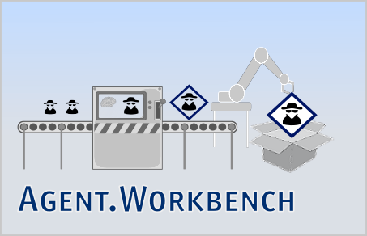

# Agent.Workbench

The documentaton is also available in our not yet comprehensive [GitBook](https://enflexit.gitbook.io/agent-workbench/)

Agent.Workbench is an [Eclipse](https://www.eclipse.org/) / [OSGI ](https://www.osgi.org/)based application toolkit and framework that utilizes the agent platform [JADE](http://jade.tilab.com/). It enables to develop agent-based, end-user oriented [RCP applications](http://www.vogella.com/tutorials/EclipseRCP/article.html) that should finally enable non-programmers to use agent technologies for their own purposes.

Why did we start developing such a tool? First reason is that JADE is probably the most sophisticated, JAVA-based agent platform. It is widlly used in academia and compliant to the [IEEE](https://www.ieee.org) / [FIPA ](http://www.fipa.org/)specifications. Since JADE was designed as middleware, the developer \(Telecom Italia S.p.A. and other\) especially focused on the actual core of the framework - agents and their interaction with their environment \(which includes other agents and thus agent communication\). In turn, that means that - despite of some administrative tools - no effort was spent to address end-user needs, which is the second reason why we started developing Agent.Workbench several years ago.

Instead of starting an agent system from command line or to start developing an agent-based application from the scratch, we believe that efforts should be reduced.

## History

The project was formally known as "Agent.GUI", it was moved from [Sourceforge](https://sourceforge.net/projects/agentgui/) July 2017.

