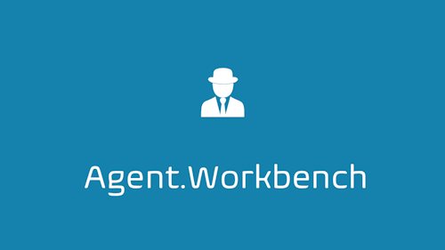

# Introduction

[Using this link, Agent.Workbench can be found](https://github.com/EnFlexIT/AgentWorkbench) [on GitHub](https://github.com/EnFlexIT/AgentWorkbench).

Agent.Workbench is an [Eclipse](https://www.eclipse.org/) / [OSGI ](https://www.osgi.org/)based application toolkit and framework that builds upon the agent platform [JADE](http://jade.tilab.com/). It supports the development of agent-based, end-user oriented [RCP applications](http://www.vogella.com/tutorials/EclipseRCP/article.html), that should finally enable non-programmers to use agent technologies for their own purposes.

Why did we start developing such a tool? First reason is that JADE is probably the most sophisticated, JAVA-based agent platform. It is widly used in academia and compliant to the [IEEE](https://www.ieee.org) / [FIPA ](http://www.fipa.org/)specifications. Since JADE was designed as middleware, the developer (Telecom Italia S.p.A. and other) especially focused on the actual core of the framework - agents and their interaction with their environment (which includes other agents and thus agent communication). In turn, besides some administrative tools, no effort was spent to address end-user needs, which is the second reason why we started developing Agent.Workbench several years ago.

Instead of running an agent system from the command line or starting the development of an agent-based application from the scratch, we believe that efforts should be reduced.

## History

The project was originally started under the name "Agent.GUI". It was moved from [Sourceforge](https://sourceforge.net/projects/agentgui/) in July 2017.
