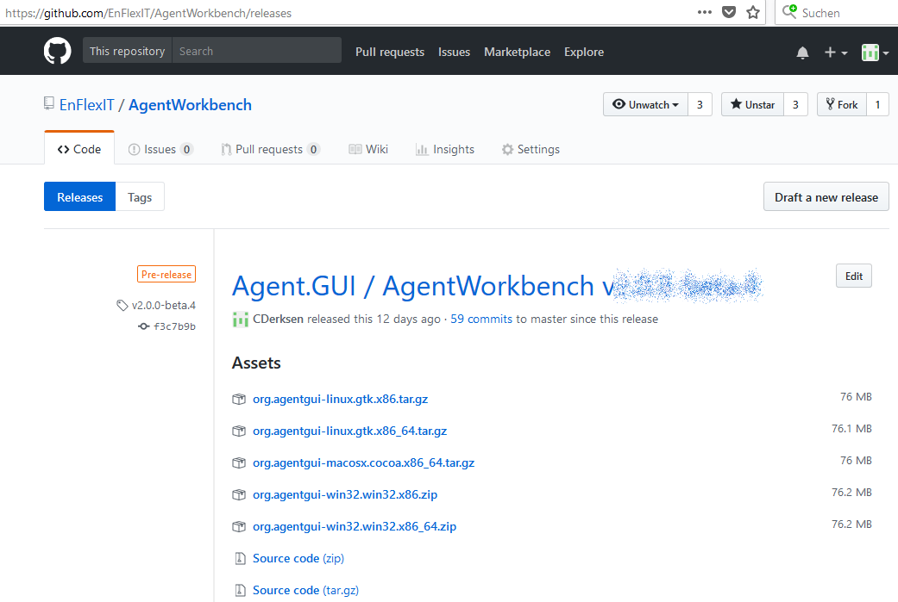
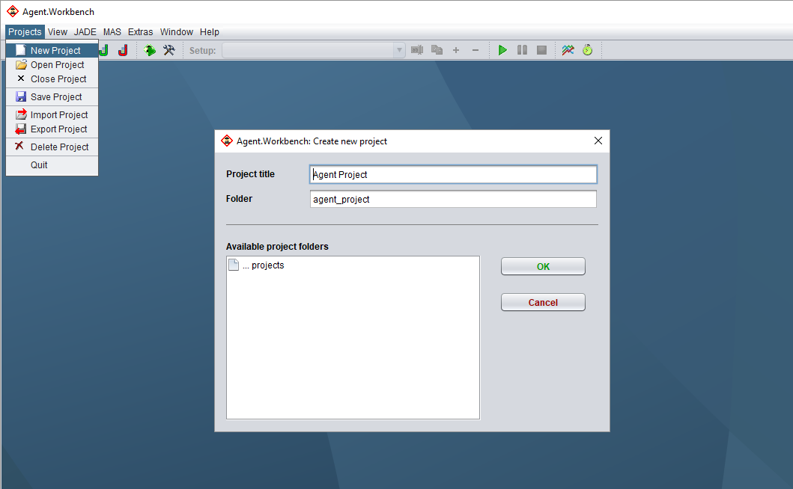
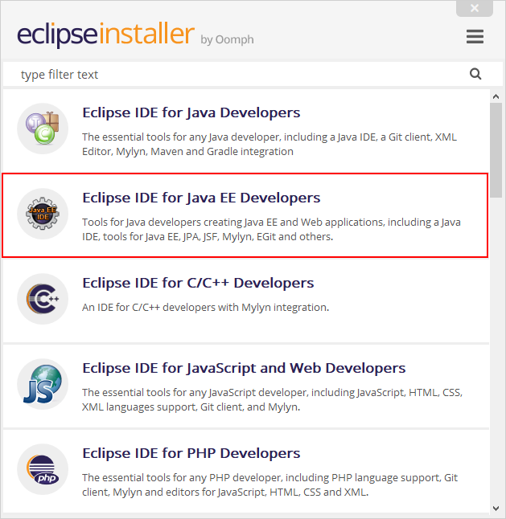
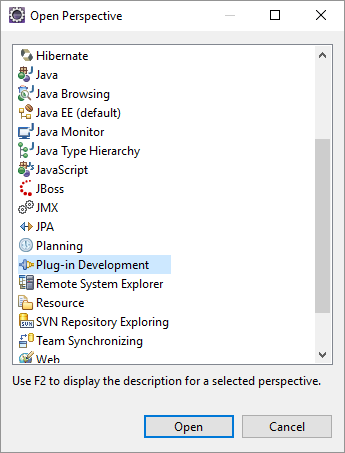
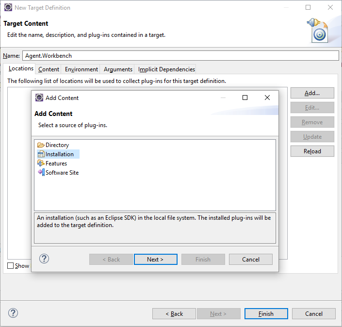

# Getting Started: Installations

This section describes the required steps, to get started with the Agent.Workbench development environment. For this the following installation and configuration tasks have to be done:

* [Install Agent.Workbench](getting-started.md#install-agent-workbench): Go to our [GitHub-Site](https://github.com/EnFlexIT/AgentWorkbench/releases) and download the latetst release of Agent.Workbench \(for Windows, Linux or MacOS\).Just extract the provided archive and place it at a desired location.
* [Create an Agent Project](getting-started.md#create-an-agent-project): After installation, start Agent.Workbench. The first start will execute a benchmark that helps us to classify your machine in case of [distributed agent executions](../awb-capabilities/distributed-application.md). Go to the menu or toolbar and create a  _**New Project**_. That's it for the moment - simply close Agent.Workbench now.
* [Install the Eclipse IDE](getting-started.md#install-eclipse-ide): We recommend to use the [Eclipse IDE for Java EE Developer](https://www.eclipse.org/downloads/) for your developments.
* [Setup your Workspace](getting-started.md#setup-the-eclipse-workspace): Create a new workspace. This is required, since you need to develop against the bundles of the Agent.Workbench installation.
* [Define the Target Platform](getting-started.md#define-the-target-platform-for-agent-developments): Create a Target Platform definition that points to the Agent.Workbench installation.

## Install Agent.Workbench

To install Agent.Workbench, navigate to the release section of our repository at github under [https://github.com/EnFlexIT/AgentWorkbench/releases](https://github.com/EnFlexIT/AgentWorkbench/releases). Depending on your operating system, select the installation package. Agent.Workbench is available for Windows, Linux and MacOS.

Extract Agent.Workbench at a desired location on your file system. Afterwards start the executable of the program \(e.g. AgentWorkbench.exe, AgentWorkbench.app or AgentWorkbench\). After the splash, the main application window appears and and the SciMark 2.0 benchmark will be executed.

### Define a target Agent.Workbench Project

To develop your own agent system or work on an existing agent project requires to define a target AWB project. These two options are described in the following.

#### Open an Agent Project from the Project Repository

Use the _**Repository-Import**_ in the _**Projects**_ menu to open the _**Project-Repository Explorer**_.  Such repository is used to provide ready-to-run projects to end users. Additionally it enables to distribute updates of agent projects. 

To import a project, simply select the desired project in the tree. If not already installed, the _**Install**_ button will be enabled and allows you to download, install and finally open the project. 

With AWB projects you can define required OSGI/Eclipse-features. If not already installed, the required features will be downloaded and installed. Thereafter, the application will automatically restarted and the project will be opened.    

#### Create an Agent Project

After the benchmark, click _**New Project**_ in the tool bar or by using the menu _**Projects**_ =&gt;  _**New Project.**_ Define a project title and the folder for your project and click _**OK**_.

The agent project will be located in the sub-directory **./projects/** beside the installation of Agent.Workbench, while the structure of the installation looks as shown in the image below. Beside this default location, you can also locate your agent projects at a different location that can be configured via menu _**Extras**_ =&gt; _**Options**_ \(opens the Option Dialog\) =&gt; _**\[Tab: Directories\]**_ =&gt; _**Projects Root Directory**_ and by selecting  the desired directory location.

For the time being, save the project and close Agent.Workbench. [A description of the project window structure will be provided here](../awb-capabilities/the-project-window.md).

## Install Eclipse IDE for Java EE Developers 

Creating new OSGI bundles, requires at least to use the Eclipse Plug-in Development Environment \(PDE\). For this, we recommend to install the Eclipse IDE for Java EE Developer that provides this environment, but also a little more. Navigate to [https://www.eclipse.org/downloads/](https://www.eclipse.org/downloads/) and download the Eclipse Installer.

Since the installer wants to create directories and copy files to it, execute the program as someone who has the right permissions. For example: if you want to install Eclipse under _C:\Program Files\jee-oxygen,_ you should have executed the installer as the administrator of the system. After the installer has started, select the right version of Eclipse and follow the further instructions.

### Setup the Eclipse-Workspace

#### For Beginners

If you have never worked with Eclipse, you should first take the time to read one of the available beginner tutorials in the web. Some of them are:

* the HTMLHelp Center of Eclipse: 

  [http://help.eclipse.org/oxygen/index.jsp](http://help.eclipse.org/oxygen/index.jsp)

  You will recognize the big tree on the left hand site that gives you an impression of the multitude of tools available under Eclipse. The introductory part can be found navigating along _**Workbench User Guide**_ =&gt; _**Getting started**_ =&gt; _**Basic tutorial**_

* the tutorial site of Lars Vogel \(vogella\) that offers a lot of tutorial in the context of Java, Eclipse, Plugin development and other. The introduction to the Eclipse IDE \(Integrated Development Environment\) can be found here:

  [http://www.vogella.com/tutorials/Eclipse/article.html](http://www.vogella.com/tutorials/Eclipse/article.html), 

If you prefer a video tutorial, you might like one of these:

* [https://www.youtube.com/watch?v=23tAK5zdQ9c](https://www.youtube.com/watch?v=23tAK5zdQ9c)
* [https://www.youtube.com/watch?v=xO5DpU2j-WE](https://www.youtube.com/watch?v=xO5DpU2j-WE)

... or simply do what most programmers do, if they have a specific question: [ask Google](http://lmgtfy.com/?q=Eclipse+beginner+tutorial)!

Starting your Eclipse IDE the first time, you will be prompted to define a workspace directory. _Background_: Eclipse organizes Java projects in different, so-called workspaces. For example: while you develop your website code in one workspace, you can develop your agent system in another. Thus it can be avoided to mix-up things that do not belong to each other.

#### For Advanced

If you are already using Eclipse for a while, you will be probably aware about switching a workspace. For sake of completeness: Go to menu _**File**_ =&gt; _**Switch Workspace**_ =&gt; _**Other**_ ****and Browse for the desred workspace location.

Having defined your workspace, Eclipse will be opened with a welcome page that points to further information or tutorials - simply close this window.

As next, we have to make sure that we use the right [Perspective](https://www.tutorialspoint.com/eclipse/eclipse_perspectives.htm). Select menu _**Window**_ =&gt; _**Perspective**_ =&gt; _**Open Perspective**_ =&gt; _**Other**_. and select the perspective for Plug-in Development.

### Define the Target Platform for Agent Developments

With a target platform you define the system or library structure against which you develop your own code. By default Eclipse would use the current Eclipse installation by itself, but - of course - our goal is to extend Agent.Workbench with your own code. Consequently, we have to define a target platform that points to the previously installed Agent.Workbench.

To do so, open the Eclipse preferences \(menu _**Window**_ =&gt; _**Preferences**_\) and type the word 'target' into the search text field \(see image\).

Further, _**Add**_ a new Target Platform definition, choose **Nothing: Start with an empty target definition** on the first dialog page and press the _**Next**_ button underneath. In the subsequent dialog:

1. Define the name of the Target Platform definition \(e.g. Agent.Workbench\)
2. Choose _**Add**_ to select the content \(bundles and / or features\) that define your target platform.
3. Select _**Installation**_, press _**Next**_ and _**Browse**_ to the installation of Agent.Workbench in your file system.
4. Again, click _**Next**_ to get a preview of the bundles / plugins to be used for your Target Platform or directly click _**Finish**_.

As a result, the field in the _**Locations**_ tab should point to your Agent.Workbench installation, saying that approx. 131 plugins were found. Click on _**Finish**_**.** The new target platform definition should now also be displayed in the list in the preference dialog. As final step mark this new definition as active \(_**tick the corresponding box**_\) and press _**Apply and Close**_.

Congratulations you are prepared to develop your first agent project with Agent.Workbench.

