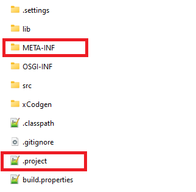
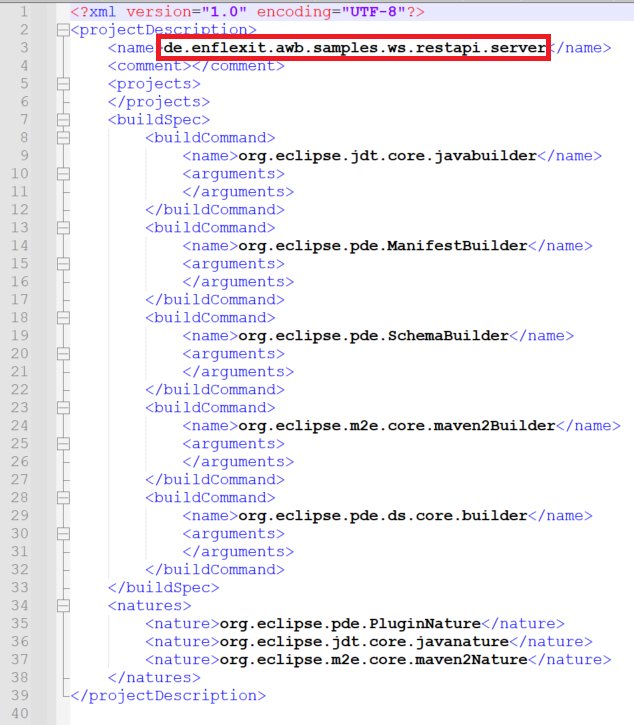
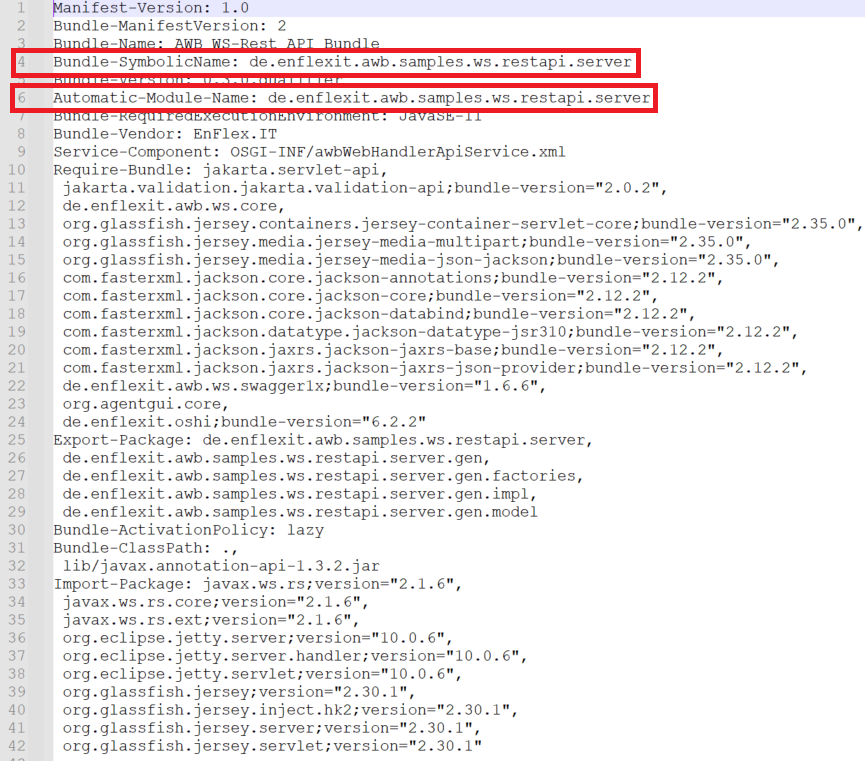
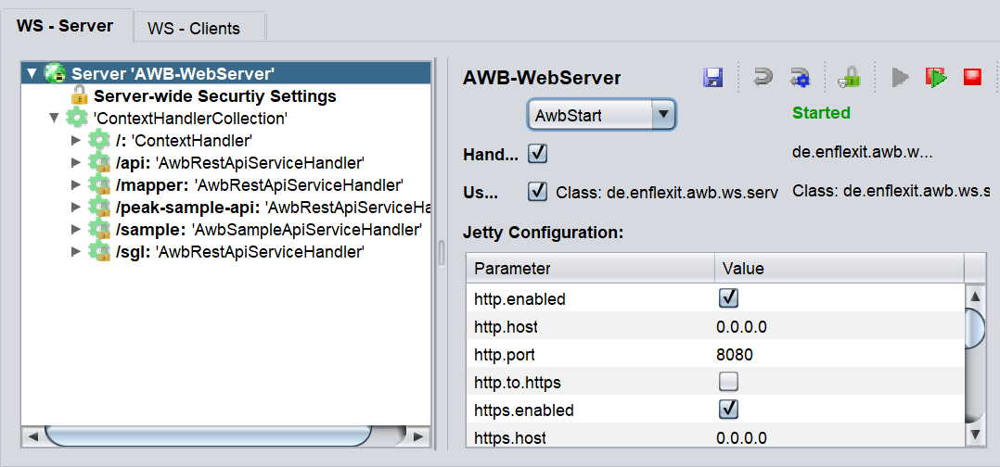
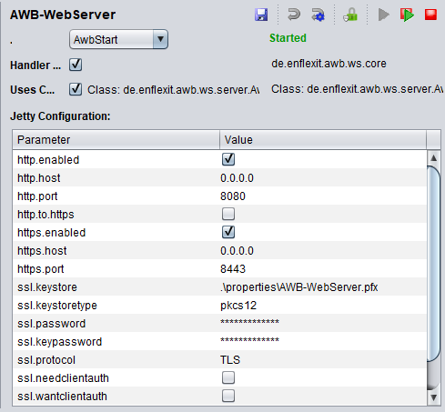

# Providing Web-Services

We will use the [de.enflexit.awb.ws.core](https://github.com/EnFlexIT/AgentWorkbench/tree/master/eclipseProjects/de.enflexit.awb/bundles/de.enflexit.awb.ws.core) bundle and [de.enflexit.awb.samples.ws.api](https://github.com/EnFlexIT/AgentWorkbench/tree/master/eclipseProjects/de.enflexit.awb/examples/de.enflexit.awb.samples.ws.api), which you can find in the example package of the awb to explain the functionality of [Jetty](https://www.eclipse.org/jetty/).

## Develop web-services

In order to develop own web-services, Agent.Workbench provides the possibility to develop a [Jetty](https://www.eclipse.org/jetty/)-server with customized REST-endpoints. In this section, we will explain in detail how you can develop a server with the AWB. The web-server is included in the [**de.enflexit.awb.restapi**](https://github.com/EnFlexIT/AgentWorkbench/tree/master/eclipseProjects/de.enflexit.awb/bundles/de.enflexit.awb.ws.restapi/src/de/enflexit/awb/ws/restapi) bundle. This bundle is the basis for further implementations of a server. If you want to develop your own server, it is highly recommended to copy this bundle and adjust it. Following, the components of the bundle which need to be adjusted will be explained.

Based on the [de.enflexit.awb.samples.restapi.client](https://github.com/EnFlexIT/AgentWorkbench/tree/master/eclipseProjects/de.enflexit.awb/examples/de.enflexit.awb.samples.ws.restapi.server), the process of developing an own web-server implementation will be explained. First, copy the [**de.enflexit.awb.restapi**](https://github.com/EnFlexIT/AgentWorkbench/tree/master/eclipseProjects/de.enflexit.awb/bundles/de.enflexit.awb.ws.restapi/src/de/enflexit/awb/ws/restapi) bundle and rename it for your purposes. After the bundle was renamed, you need to adjust the .project-file and the Manifest.mf. In the picture below, you can see where you can find both files.

<figure><figcaption>
Bundle-structure
</figcaption></figure>

Inside of the .project-file, you need to adjust the name of the project. The name must be the same as the bundle-name, which was specified before. In the picture below, you can see that you need to adjust the name at the top of the project-file.

<figure><figcaption>
.project-file
</figcaption></figure>

The name of the bundle also needs to be adjusted inside the Mainifest.mf file of the bundle. In the picture below you can see, where the bundle name needs to be adjusted.

<figure><figcaption>
Manifest.mf
</figcaption></figure>

After the name was adjusted, you can import the bundle in Eclipse. This can be done by right clicking on the bundle-package and then use the option import as a project.

## Configure web-services

Agent.Workbench provides a user-interface in order to configure web-services. You can acces it via the menu-bar of the AWB (see Image below).

<figure><figcaption>
WS-Configuration panel Icon
</figcaption></figure>

After the icon was selected. The WS-Configuration panel will show up. There you can see all active or non-active web-services/ -servers of the AWB. Additonally, you can retrieve further information about the services and customize them for your purposes (see Image below).

<figure><figcaption>
WS-Server Configuration panel
</figcaption></figure>

### Server-wide settings

As you can see in the picture above, there are a lot of options to customize a web-server. Don't worry, we will discuss every important option in detail. First, we start with the most important option, where should your server or web-service run and when should it start?

On the left side you can see all available servers. If you select the root of a server tree, you can see the basic informations, which include the start options and adress of the server. You can select four start options: Start the server when the AWB starts, start the server when a project is loaded or jade is started and you can start the server manual. The start options are selectable via the drop-down menu . You can find them below the name of the server on the right side. Moreover, you can also retrieve the state of the server. The state is started or stopped, it can be seen on the right side of the panel (see Image above).

However, your changes are not saved yet. In order to save them, you need to click the save icon   in the menu bar. To reset your current changes to the previous seetings, you can click this icon  and to reset to the default settings you can use this icon (see Image below).&#x20;

<figure><figcaption>
Menu-bar WS-Server-Configuration Panel
</figcaption></figure>

You can start and stop the AWB-Webserver with the buttons on the right side (see Image above). If the server is not started yet, the start button will be colored green. If the server is running the start button  will be grayed out. The same mechanic applies to the stop button and restart button . They will be grayed out if the server is not running and colored red if the server is running. If you want to reset the SSL-keystore of the AWB, you can use the button with the lock  .

<figure><figcaption>
Server-wide settings
</figcaption></figure>

You can also configure Jetty for your purposes. It is possible by selecting the root of the server-tree chart (see Image WS-Server Configuration panel). You can decided if _http_ is enabled and on which port the server should be listening. This can be done by editing the _http.port_ and _http.host_. The same procedure can be done with _https_, through the options _https.port_ and _https.host_. Additionally, you can define, where you want to save your SSL-Keystore and which type it should have. You can also define the _ssl.password_, _ssl.keypassword_ and you can also choose the protocol you want to use.&#x20;

However, the protocol should be supported by _Jetty_. In most cases, there is a drop-down menu for supported options, for instance for the supported _ssl.keystoretypes_ . However, for the ssl.protocols there is no drop-down menu. Nowadays, only the _TLS_ protocol is supported by default.&#x20;

### Security settings

Besides the server wide options, there are security settings you can customize. This can be done by selecting a node of the server-tree, which is called **Server-wide Security Settings**

<figure><figcaption>
Security Settings
</figcaption></figure>

In the security-settings, you can select the security handler. The security handler is essential if you want to secure the APIs of your server. Until now, you can choose between two security handlers: The _SingleApiKeySecurityHandler_ and the _SingleUserSecurityHandler_. Hence, you can secure your server with API-Keys and User-Password credentials. In the image above, you can see the SingleApiKeySecurityHandler. You can choose a security handler via the drop-down menu. If you want to secure your server, you need to fill the values of the security handler. In case of an API-Key its name and value needs to be filled. After you filled it, you need to save the changes by clicking the save button . Additionally, you need to check if the security handler is activated. This can be done by viewing the checkbox on the right side . In case the handler is activated, the checkbox will be checked.
