# Using Web-Services

## ... with an Agent

The AWB enables agents to communicate with web-services. They can receive commands and send commands to web-services. Therefore agents need a client-service. Client-services can be implemented via [Swagger](https://swagger.io/). It is a tool which simplifies the development and implementation of REST-services and -clients. It enables the automatic creation of classes based on a yaml-file, which need to be specified by a developer. In the following it will be discussed, how a yaml-file can be created and classes can be created automatically.

During this introduction,the _de.enflexit.awb.samples.ws.restapi.client bundle_ will be used_._ This bundle is an example on how to use an agent in order to interact with a web-service. It will be used to explain how agent can use and communicate with a web-service.

### Swagger

Swagger enables to generate a REST-client automatically. The JAVA-classes are generated on basis of a YAML-file. We will use the YAML-File of the _de.enflexit.awb.samples.ws.restapi.client_ to explain how SWAGGER generates JAVA-classes from a YAML-File_._ You can find it in the xCodegen package of the bundle_._

<figure><figcaption>
General Information of the REST-API client
</figcaption></figure>

In line 1 of the YAML-File the version of the OpenApiSpecification is defined. You can give the API a title and a description (see line 5-6). You can also give further informations, for instance contact informations (see line 7-10) and you can also specify under which licence the APIs published (see line 11-14). Additionally, it can be specified which authentication method are supported and necessary for a authentication (see line 24-25) (see Image above).

From line 17 to 21  necessary informations for the client about the server are defined. You can add several servers the client should authenticate with. Each server needs a URL and a description. To organize the paths of the REST-API you can define tags (see 28-30).

<figure><figcaption>
Paths of the REST-API
</figcaption></figure>

The path section defines the individual endpoints of the API. We will use the _info_ endpoint from line 33 to 50 in detail (see Image above). In line 33 to 34 the path of the API is defined. However, there are several option how you can define the paths of the API, you can find further options [here](https://swagger.io/docs/specification/basic-structure/).&#x20;

Moreover, you give the operation an summary (line 38) and a description (line 39) and a external documentation (line 41-43) to explain and describe the purpose and result of the operation. Furthermore, the response of the operation need to be specified. This was done in line 44 to 50. You can define a HttpsStatusCode for the response (see line 44-45) and the schema of the content of the expected response (see line 46-50). In case of the Info-endpoint, the content is defined with a reference to a schema of the type SystemInformation (see line 50).

&#x20;

<figure>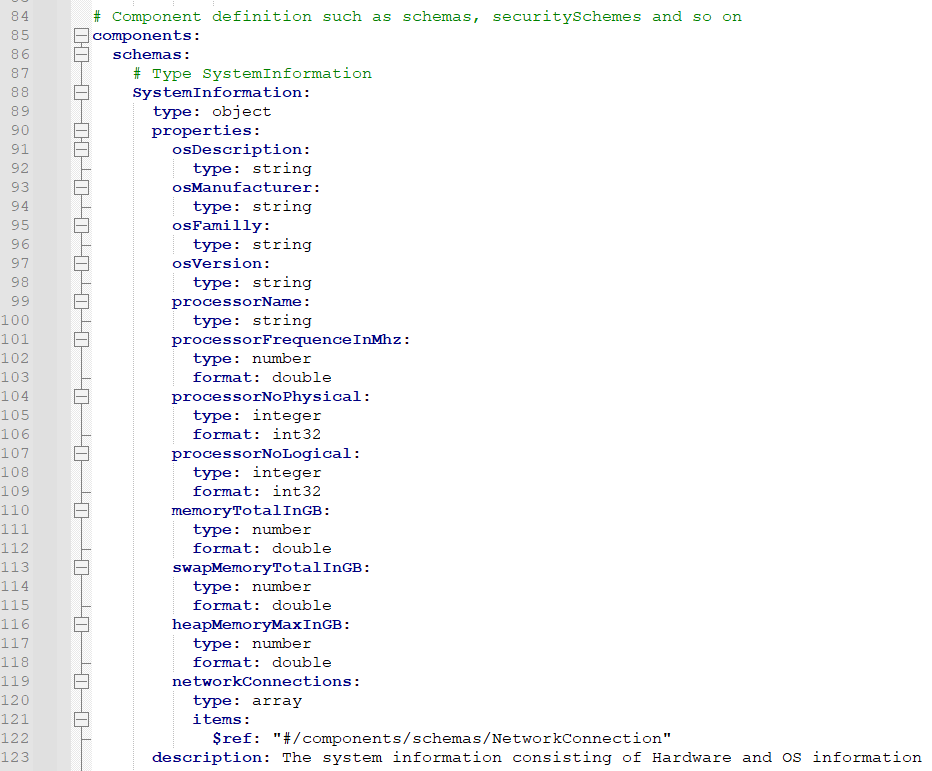<figcaption>
Component schema
</figcaption></figure>

The schema can be found inside of the YAML-file, the _$ref_ indicates that it is an internal reference. From line 84 to 123 you can define the referenced schema (see Image above). The schema secures that accordingly to an output of an operation, the right response-type will be selected. The components/schema schema allows the developer to define common data structures, which are used inside the client. The data structures can than be referenced via $ref.&#x20;

The scheme for SystemInformation consists of multiple properties. Every properties need to have a type and a format. You can find the available types and formats for properties [here](https://swagger.io/specification/#data-types).

<figure><figcaption>
Security-Schemes
</figcaption></figure>

In the security schemes section, the developer can define the authentication methods the client need to support in oder to communicate with a server. Nowadays, Swagger supports HTTP authentication, API keys, OAUTH 2 and OpenID Connect Discovery. You can finde the support authentication methods [here](https://swagger.io/docs/specification/basic-structure/).

### Generate JAVA-classes from a YAML-File

We discussed the core elements of a YAML-File, but we still need to answer how you can generate JAVA-classes automatically from a YAML-File. A option is to use the _openapi-generator-maven-plugin._ A POM for the generation of JAVA-classes with the openapi-generator-maven-plugin can be found in the xCodegen-Package of the de.enflexit.awb.samples.ws.restapi.client (see Image below).

<figure><figcaption>
POM OpenAPi-Generator
</figcaption></figure>

### AwbApiRegistrationService-Interface

In order to use a web-services through an agent, it is necessary to create a class, which implements the _AwbApiRegistrationService_-Interface. This interface needs to be implemented in order to define essential information of the web-service you want to use. In the image below you can see a class, which has implemented the AwbApiRegistrationService (see Image below)&#x20;

<figure><figcaption>
Java-Class implement the AwbApiRegistrationService
</figcaption></figure>

It is recommended to name the service after the web-service it tries to interact with. For instance, a class which implements the _AwbApiRegistrationService_ and interacts with a server named _RandomServer_ should be named _RandomServerApiRegistrationService_. The service needs to define essential information about the server by overriding the methods of the _AwbApiRegistrationService-Interface_

The method _getDefaultServerURL_() enables a developer to define the address of the server. Additionally, if the server needs a credential, the type of the credential and its name needs to be defined. This can be done through the methods _getCredentialType()_ and _getDefaultCredentialName()_. Nowadays the AWB supports three types of credentials: Api-Keys, Bearer-Tokens and UserPassword-credentials.

Furthermore, in the method _getDescription()_, you can describe the purpose of the client-service and in the method _getClientBundleName_() the name of the bundle where the client-services is located. After the client-service is defined, you can use the _AwbRegistrationService_ in an agent class to retrieve a credential.

## Request a credential with an agent

With the method _getCredential_() of the WsCredentialStore the agent can request a credential. Therefore, two parameters needs to be passed to the method _getCredential_(). The type of the credential, which is requested and the corresponding _AwbRegistrationService_ of the server, the agent want to interact with. This can be done by passing a new object of the required credential class and a reference of the corresponding _AwbRegistrationService_ of the server.

<figure>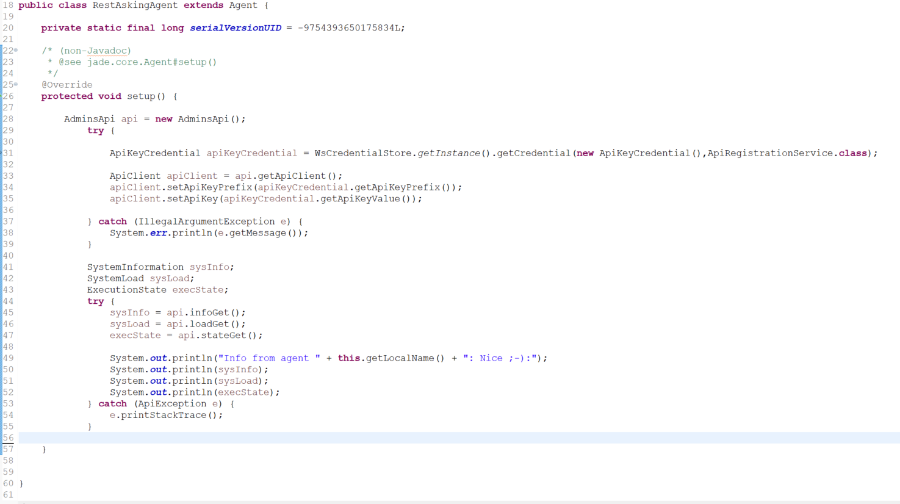<figcaption>
RestAskingAgent
</figcaption></figure>

If a suitable credentials is found, which fulfils the criteria’s provided by the _AwbRegistrationsService._ The method will select the credential and use them to connect with the server. Nevertheless, if the credential is empty, but fulfils the standards provided by the _AwbRegistrationsService_. The method getCredential() will throw an _IllegalArgumentException_. An empty credential needs to be filled by the user through the user interface of the AWB.

### How a user can edit a credential

A user of the AWB can access the WS-Configuration Interface through the green AWB logo in the menu bar (see picture below).

<figure>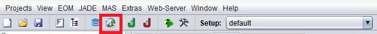<figcaption>
Menu bar
</figcaption></figure>

After the button was clicked the WS-Configuration-Interface wil show up. At first you will see the server view of the WS-Configuration-Interface. In order to change to the client view. You need to select the WS-Clients Tab (see picture below). The client view can be used to assign credentials to bundles, in order to make them accessible for agents. Additionally in this view, you can create credentials and edit them.

<figure>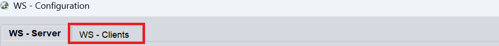<figcaption>
Ws-Configuration Interface Tabs
</figcaption></figure>

On the right side you can see the credential area. There you can create, delete  and edit credentials . In case the user had not assigned a credential, before requesting a certain credential with an agent and an _AwbRegistrationService_, an empty credential will be created. This credential will have the name specified in the _AwbRegistrationService_ used to request a credential. Furthermore, in the credential view it will be marked yellow and the name of the credential will not have the type of the credential in front (see picture below).&#x20;

<figure>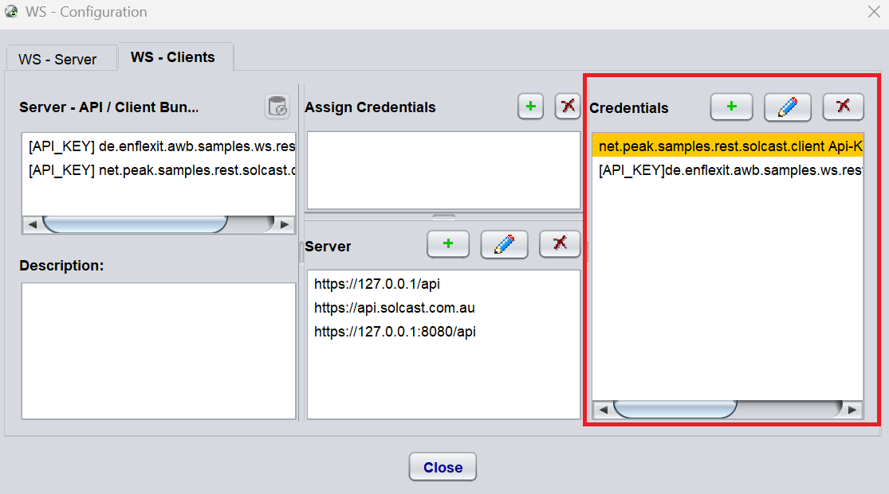<figcaption>
WS-Client credential-view
</figcaption></figure>

This credential is already assigned to a bundle. Since it was created automatically by the AWB, when it was requested by an agent. The AWB discovered that no credential was created for a certain bundle in combination with a Server-URL. You can fill the credential by editing it and fill the values of the credential.

It is possible to edit a credential by selecting it and then clicking on the pen . After that a pop-up for editing a credential will come up (see picture below). The pop-up will show the name of the credential at the top of the pop-up panel. At the bottom of the pop-up panel, you can find the specific values of the different credentials. For instance, if it is an API-Key you can find the possibility to edit the prefix and the key of the API-Key. However, this is different for every credential. After that you can click the create & saved button to save the changes. If you do not want to change anything, you can just close the window.

<figure>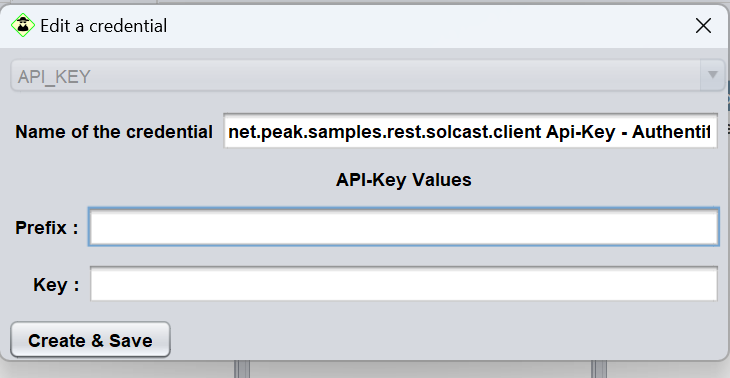<figcaption>
Edit a credential pop up
</figcaption></figure>

After the credential was filled, it will not be marked as yellow anymore and you can find it in the credential list.&#x20;

### Assign a credential

If a credential is not assigned, you can assign it to a bundle. The AWB also automatically assigns a credential to a bundle, if it was automatically created by the AWB as an empty credential. However, why do you need to assign a credential, a Server-URL and a client-bundle? In order to communicate with a server or webservice, the agent needs a credential for a certain webservice with a reachable web-address. The web-address is represented by a small Server-panel of the WsConfiguration-interface (see picture below).&#x20;

<figure>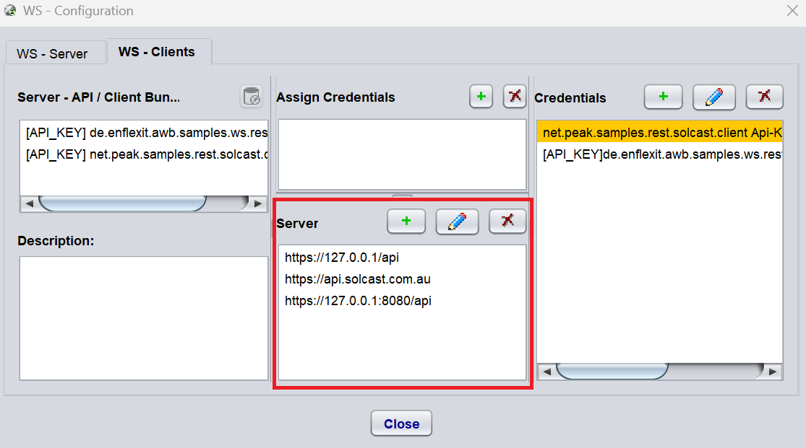<figcaption>
WS-Client Server VIew
</figcaption></figure>

If you want to create or edit  a Server-URL a pop-up is showing up. There you can type in the web-address of the web-service or server (see picture below). Moreover, the Server-URLs can also be automatically created by the AWB through the definition in an implemented _AwbApiRegistrationService._&#x20;

<figure>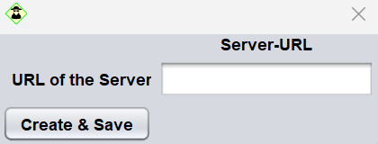<figcaption>
Server-URL Pop-up
</figcaption></figure>

In case of editing a Server-URL the current URL of the webserver will show up and can be edited in the pop-up. if you want to delete a server, you need to select the server and click the delete button . Additionally, if you edit a assigned credential or server it will not change its assignment to a bundle, this need to be deleted manually.

#### Client bundles&#x20;

On the left side of the WS-Client view you can see the bundles which implemented _AwbApiRegistrationService_. This lists are filled dynamically, for instance if a new bundle implements a AwbApiRegistrationService, it will show up on this list. A user of the AWB can assign credentials to these bundles. This can be done by selecting a client-bundle in the client-bundle list on the left side of the WS-Client panel (see picture below).

<figure>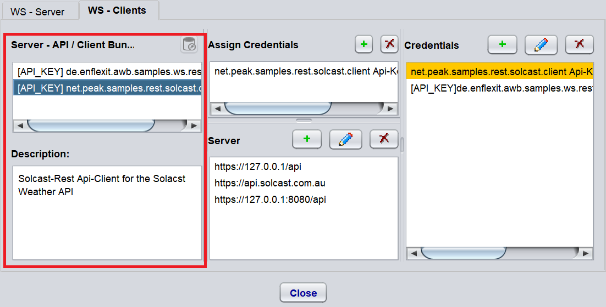<figcaption>
Client-Bundle list
</figcaption></figure>

You can also find a description of the purpose of the bundle, which is below the client bundle list on the left side. Furthermore, if you select a bundle and the selected bundle has a credential assigned, the assigned bundle will show up in the assigned credential list. If you select a client bundle in the client bundle list, the assigned credential list will be filled dynamically in case the select bundle has an assigned credential.

<figure>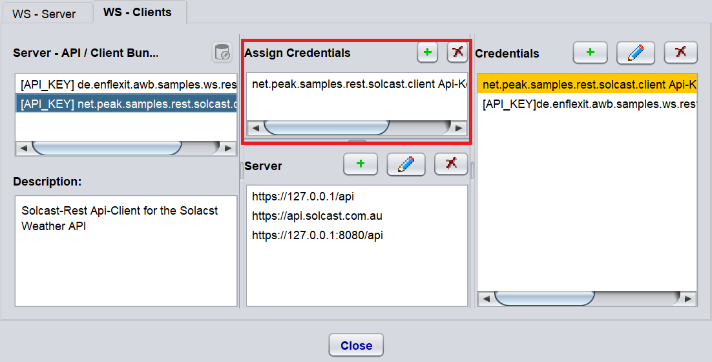<figcaption>
Assigned credential list
</figcaption></figure>

If you select the credential assignment, the assigned credential will be selected in the credential list on the right side of the panel. The assigned server will be selected in the server list in the bottom of the center of the panel (see picture below). In order to delete a credential assignment, you can delete it with the delete button . If you want to create a new credential assignment you should select the bundle, the credential and the server you want to assign to each other. After you select them click the plus button  on the Assign-Credential-Panel in the middle. You sucessfully assigned the credential.

<figure>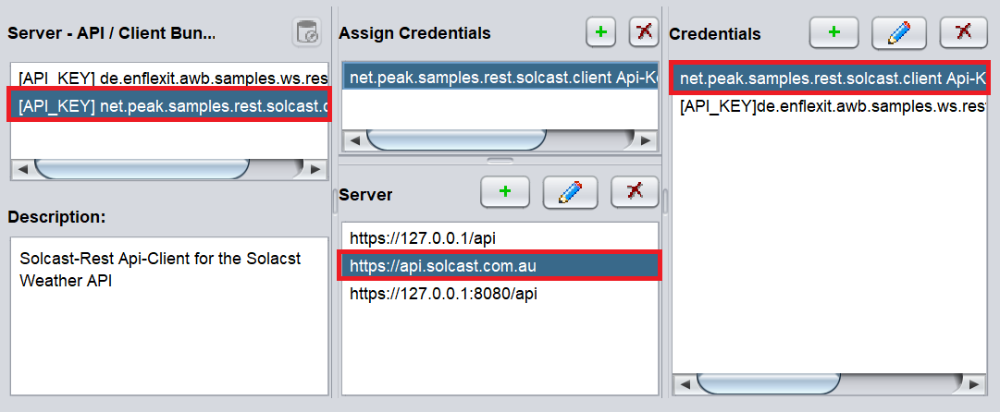<figcaption>
Selected entities of credential assignment
</figcaption></figure>

### Cached credential assignments

Since the client bundle list is filled dynamically during the runtime of the AWB, it can happen that a bundle is deleted or added. Adding a bundle is not a problem if it is new, but what if it was added before. Are further credential assignments still stored for the bundle and you can reuse them? Furthermore, in the case a bundle is deleted during runtime what happens to the stored credential assignments?

In case a bundle is deleted and has still credential assigned, it will be cached. You can see the cached credential assignments and the cached bundle by clicking the cached credential assignment view button . You can find it on top right of the client bundle list (see picture below). In case there are no cached credential assignments and bundles, the button will be grayed out and not accessible.

<figure>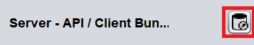<figcaption>
Cached credential view button
</figcaption></figure>

After the cached credential assignment view button was clicked the view of the WS-Clients Panel will change. Specifically, the JList with the client bundles will be filled with cached client bundles and the description of the different bundles will be grayed out. The server panel and credential panel remain unchanged. If you want to go back to the Client-View with active client bundles, you can click the back button on the left side above the list of the client bundles (see the picture below).&#x20;

<figure>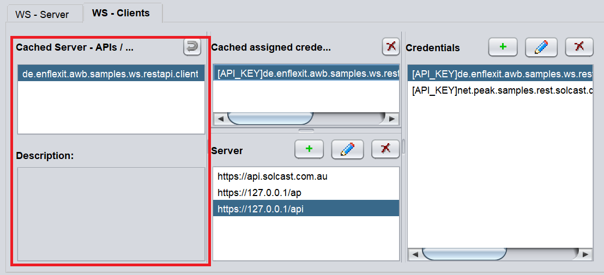<figcaption>
Cached bundle panel
</figcaption></figure>

In the middle you can find the cached credentials assignment. You can fill the cached credential list, by clicking on a cached credential bundle. This is the same mechanic as before in the active client-bundle view. Nevertheless, if you want to delete a cached credential assignment there are two options. On the one hand, you can delete it by selecting the assigned credential and use the delete button above the list (see picture below).

<figure>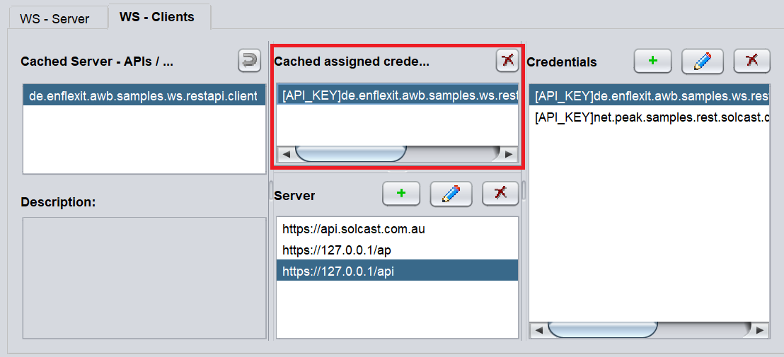<figcaption>
Cached assigned credential view
</figcaption></figure>

On the other hand, you can delete all assigned credential by right-clicking on the cached bundle in the cached bundle list. Then a pop-up is showing up, where you can delete all cached credentials of one bundle (see picture below).

<figure><figcaption>
Delete all credential assignments of a cached bundle
</figcaption></figure>

In case all credential assignments of a cached bundle are deleted, the bundle will be deleted as well. Additionally if all cached bundles are deleted, the AWB will be switch back automatically to the active client view.&#x20;

### Summary

The AWB enables agent to use web-services, request credentials for them and retrieve/define information about the web-services they use. The user can fill  the credentials the agent requests through a user-interface and define which credential an agent should use.&#x20;
