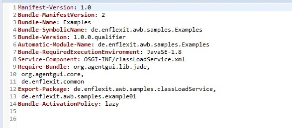
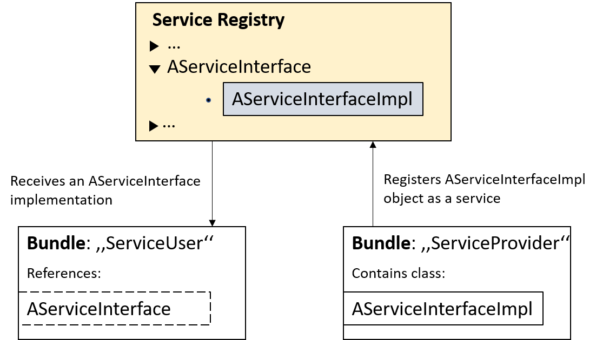
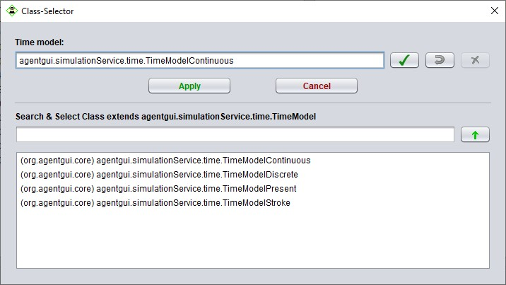

# OSGI / ClassLoadService

The extensibility of Agent.Workbench is suported by its modular architecture, that is based on the OSGi specification for modular application development in Java. A general understanding of OSGi and what implications it has for Agent.Workbench is advantageous if you want to extend Agent.Workbench with own components. The most relevant aspects of OSGI are briefly introduced in the following, if you want to dig deeper see [https://www.osgi.org/](https://www.osgi.org/).

## OSGi

#### OSGi bundles

The modularization approach of OSGi goes beyond the package and visibility concepts provided by standard Java. Logically coherent packages and classes, for example all code that is required for implementing a specific functionality, is encapsulated in a so-called bundle, keeping implementation details private while providing a clearly specified interface for interactions from other bundles. All resources of a bundle are hidden from other bundles by default, unless explicitly exported. Dependencies to other bundles must be specified on either package or bundle level - the latter is preferred int the Agent.Workbench context. Code from other bundles will only be accessible if explicitly declared as dependency \(bundle level\) or import \(package level\). Dependencies and exports, together with other metadata, are specified in the bundle's MANIFEST.MF file. 

This is the MANIFEST.MF file from the Examples bundle. You can see that it stores the Bundle-Name, -Version and other important metadata. The Require-Bundle section \(line 9\) defines all bundles that our Examples bundle depends on, while the Export-Package section \(line 12\) specifies which packages will be exported, to be accessible from outside.

Eclipse provides a graphical editor, which assists the developer to create and edit the MANIFEST.MF. It provides several tabs with configuration options for different aspects, like general metadata, dependencies or exports, while the resulting manifest file can be seen and edited on source code level on the MANIFEST.MF-tab. If you want to know how to configure a basic MANIFEST.MF file for an Agent.Workbench bundle, check out our [_Create an Agent Project_](../basic-steps/create-a-project-plugin.md#creating-a-hello-world-agent)  tutorial where we go through all the steps.

#### OSGi service concept

The service concept plays an important role in the context of OSGi. While the coupling between bundles via dependencies is rather close, services provide a more flexible way to provide or access services to/from other bundles \(loose coupling\). Services are defined by Java interfaces, specifying the functionality of the  service. Bundles can provide an implementation of the service by implementing this interface \(and providing some metadata, see below\), and registering their implementation in a service registry, where other bundles can find it based on the interface. There may be several implementationf of the same service to choose from. 

To demonstrate this, lets assume the bundle _ServiceUser_ references a certain interface called AServiceInterface. Bundle _ServiceProvider_ contains a class AServiceInterfaceImpl that implements this interface, and registers the object as a service in the service registry under the interface name. The _ServiceUser_ bundle can now access the provided service thru the service registry.

If more than one service is registered under a specific interface, the bundle has the opportunity to choose an implementation. If a desired service is not yet registered, a bundle can listen for a specific service to appear.

For every service provided by a bundle, an XML file providing some metadata must be placed in the folder OSGI-INF. This mainly just specifies which service interface is implemented and wich implementing class is used - Eclipse provides a graphical editor for this. This medatada file must be mentioned in the Service-Component section of the bundle's manifest file, as shown in line 8 of the example file above. Unfortunately the manifest editor of Eclipse does not support thhis yet, so this must e done on source code level. 

## Class extensions

### The ClassLoadService

The ClassLoadService is a useful concept in the context of an OSGI environment. Contrary to how class loading is performed in other Java application, in OSGI there is only one class loader per bundle. This classloader serves all classes in the bundle. In Agent.Workbench, classloading is done with the help of OSGI-services. Every bundle provides an object of the _ClassLoadServiceImpl_ \(which implements the classLoadService\) in the service registry under the ClassLoadService interface on bundle-start.

The modularized architecture of an OSGi-based applicaiton has implications for the clas loading process. While in a non-modular Java application, all classes are on the same class path and handled by the same class loader, in OSGi every bundle has its own class path, and consequently its own class loader. Usually this is no problem, but in some cases Agent.Workbench instantiates classes in a reflective way, which requires access to the class loader that is responsible for that class. That is usualy the case when classes can be selected from a list based on their superclass, as shown in the screenshot below for different TimeModel implementations.

For those cases, the ClassLoadService was developed to instantiate classes from other bundles using an OSGi service. Thus, if your bundle provides agent classes \(i.e. classes extending jade.core.Agent\), ontologies, time models, project plugins or static or dynamic load balancing mechanisms, it must also provide a ClassLoadService implementation to make these classes accessible for Agent.Workbench.

However, since the implementation is the same for every bundle, you can usualy just copy it from another bundle. The only thing that needs to be adjusted is the service definition xml file, where the class name must be adapted to the package structure of your bundle. Details on this are given in the Create new Bundles tutorial.

