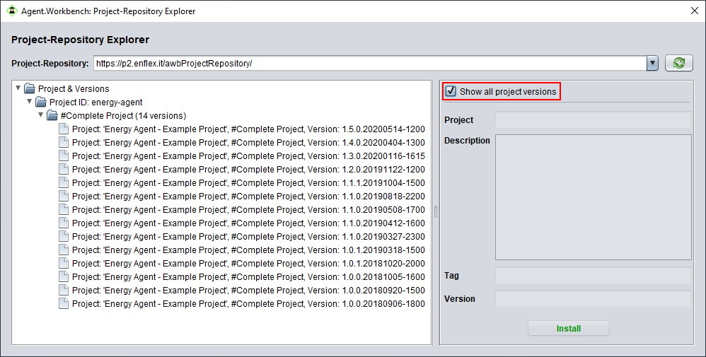

# Project Import and Export

In Agent.Workbench you can share your projects with others and utilize existing projects from other developers. The feature that makes this possible is the project import and -export.

There are two ways for users to distribute and obtain AWB projects. Either on the direct way by exchanging project files, or through a remote repository. The first option is convenient if you want to share your project with few people \(e.g for demonstration purpose\), the latter one if your goal is to share the project with a large number of people. Using a repository also allows providing updates, which can be downloaded automatically by the users.

This tutorial covers both ways, how to [export your project locally](project-import-and-export.md#export-project-file) and [import received project](project-import-and-export.md#import-project-file) files to you Agent.Workbench application, as well as how to[ export your projects to a remote or local repository](project-import-and-export.md#export-project-repository) or [import projects from a repository](project-import-and-export.md#import-project-repository) to your application.

## Export: Project File

The regular project export without repository comes in two flavors: You can do a "normal" export, the result will be an archive file containing all resources of your project \(unless configured otherwise, see below\). Other users can import this file into their Agent.Workbench instance as described below. The other option is to bundle your exported project with an Agent.Workbench installation package. The result will be an Agent.Workbench installation package for the target operating system you select, with your project already integrated in its project folder, so users can just extract it and start working.

To export an Agent.Workbench project go to _Projects &gt; Export Project_ in the menu bar.

If no project is opened, a project selection dialog will be displayed. Select the project you want to export. If one or more projects are opened, the project that is currently focussed will be exported.

A dialog is displayed, which provides several options to confirure your export. The first option specifies wether your export should contain the project files only, or include an Agent.Workbench application. For the latter case, select the "Include Installation Package" checkbox, and select the Agent.Workbench version for the desired operating system from the list below. If the list is empty, you have to configure the Installation Packages Directory in your Agent.Workbench options, [see below for the details](project-import-and-export.md#providing-agent-workbench-installation-packages-for-a-bundled-export). For exporting the project files only, just leave the box unchecked.

In the main section of the dialog, you can select which project resources to include in your export, either on the basis of the project setups or the individual files. When selecting or deselecting setups from the list on the left, the files related to the setups will automatically be selected or deselected in the tree view on the right, where you can also select or deselect individual files \(make sure you know what you're doing\). Files with disabled checkboxes are required by Agent.Workbench to properly handle the project, and thus cannot be deselected.

Then select the location where you want to save the exported package to. In this dialogue you can also specify the file format for the project file. ".agui" is the suffix for Agent.Workbench project files, which are technically identical to .zip files. Nevertheless it is recommended to use this suffix, to point out that the archive actually contains an Agent.Workbench project. Click Save \(Speichern\) to finish the export. A notification dialog will be shown when done.

The exported project file can now be distributed and imported by other Agent.Workbench users. If an installation package was included, the file can just be unzipped, the resulting Agent.Workbench instance will have the project in its project directory.

### Providing Agent.Workbench installation packages for a bundled export

To export the project in combination with an Agent.Workbench application, you must have an installation package for the desired operating system available on your machine, and the path to it must be configured in your Agent.Workbench directory settings. 

If not already available, you can download the current \(and earlier if needed\) Agent.Workbench installation packages for different operating systems from [https://github.com/EnFlexIT/AgentWorkbench/releases](https://github.com/EnFlexIT/AgentWorkbench/releases). Under Assets, choose the desired version.

When all required installation packages are available, open the Agent.Workbench Options \(_Extras_ &gt; _Options_ in the menu bar\) and navigate to the Directories tab. Under _Installation Package Directory,_ specify the path of the folder where you stored the installation package \(use  to browse to the location\). The dialogue will immediately show all installation packages that were found in the selected directory. Make sure to _Save_ your changes before closing the dialog.

## Import: Project File

The following steps show you how to import an existing project into your Agent.Workbench application.

In Agent.Workbench go to _Projects &gt; Import Project._

In the upcoming window, browse to the location where the project is located and select the project. Then click _Import Project_.

Agent.Workbench will then load the project to your application and immediately open it. Once the project is imported, it is stored in the _Projects Root Directory_ and can be edited and executed.

## Export: Project Repository

Project repositories are beneficial if your project is used by a large number of end-users, or if you intend to provide updates in the future. Every web server can serve as project repository. Exporting a project to a remote repository requires two steps. First, export the project to a local repository on your machine. In a second step, you need to transfer the project from your local repository to the desired server via FTP \(File Transfer Protocol\).

#### Export the project to a local repository

The path of your local repository directory must be specified in the Agent.Workbench application. To do so, open _Extras &gt; Options_ and head to the _Directories_ tab. Under _Local Project Repository,_ specify the path of your local repository \(use  to browse to the location\). Don't forget to _Save_ you changes.

To export the project, navigate to _Project &gt; Repository Export_. The next steps are the same as for the [project file export,](project-import-and-export.md#export-project-file) except that you do not specify the export destination folder and file. Instead, the project will be exported to your local project repository, and the file name will be generated automatically based on project name, project tag and version number \(see project handling\).

Besides the exported project file, you will find a file called _awbProjectsRepository.xml_ in your local repository. This file keeps track and provides information about the projects currently available in the repository, including their version history. If the file is not present it will be created when exporting to the repository, otherwise an entry for the new export will be appended. When deleting files from the repository manually, make sure to remove the corresponding entry from the .xml file to keep it consistent with what is actually available.

#### Uploading the project to a remote repository

To upload the exported project from your local repository to the server, you can use any FTP client \(e.g. FileZilla\). Besides uploading the project file itself, the server's _awbProjectsRepository.xml_ file must also be updated. Keep in mind it must be consistent with the files that are available on the server!  This is very important, since the project selection shown to the user when [importing from the repository](project-import-and-export.md#import-project-repository) is based on this file. If your local file is in sync with the server, you can just upload it and replace the remote file. If it is not, you should download the server's xml file and add an entry for your new export manually, e.g. by copying it from your local file. When deleting projects or versions from the repository, make sure to remove the entries from the file accordingly.

With that in mind, upload the project and the .xml file to the server via FTP to finish your export and publish it in your remote repository.

## Import: Project Repository

The project import from a remote repository is demonstrated by importing the energy-agent demo project.

To import a project from a repository, inside the Agent.Workbench application go to _Projects &gt; Repository Import_.

In the upcoming Project Repository Explorer window, select the URL of the repository you want use from the drop-down list at the top - the URL for the energy agent project repository is available by default. In the tree view on the left side, the content of the selected repository is displayed. This is structured hierarchically as follows: Project ID &gt; project tag &gt; version number \(see the project handling page for details\). By default, only the most recent version of a project is shown. If you want to access an older version, check the _Show all project versions_ box on the right. To import a project into your Agent.Workbench application, select the desired version from the tree and click _install_. Afterwards, it can be updated from the repository automatically or manually \(see below\).

Agent.Workbench will then load the project to your application and immediately open it. Once the project is imported, it is stored in the _Projects Root Directory_ and can be used.

On the _Info_ page of the imported project, you can determine the update behavior of the project. With the button you can manually search for updates.

