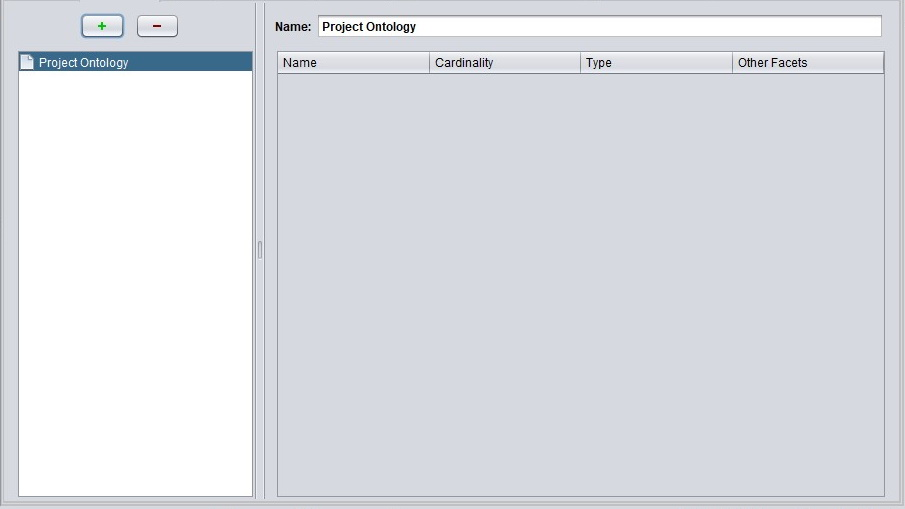
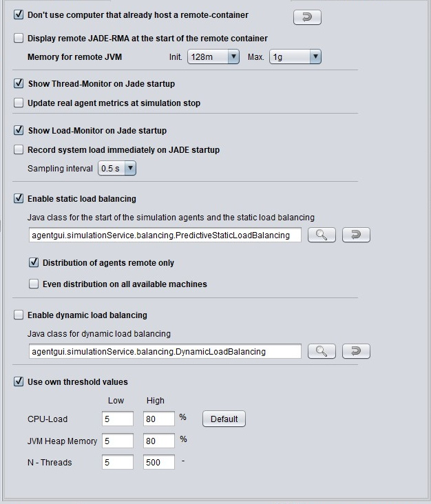

# Project Window Structure

AWB projects differ, depending on the domain, which artifacts are required and how the project is configured. But the core structure is similar throughout all projects. In the following, we are going through an example project to understand how a project is built up and what configuration options it provides. This page simply describes the project window structure. If you are looking for in-depth information on configuration options, follow the provided links.

First up, Agent.Workbench provides different options regarding the project window presentation in the _View_ menu. An optional Tab-Header or the Project tree can be applied to the window if demanded. The same goes for the console and the heap monitor, which aren't specific to the project window.

When working with projects, we can distinguish two groups of people, the [project developers and the end-users](../../overview/#who-uses-agent-workbench). Agent.Workbench provides separate views for each group. The developer view with specific configuration options and a reduced end-user view. 

## Info

Common to every project is the Info page. The Info page defines the Project Title, provides space for a description of the project and lets you configure some general settings regarding the project. Additionally, it shows where the project is saved and which tab \(node from the project tree\) is used as the initial view when the project opens. Further, a project version and an update-site can be configured, if a project is opened in the so-called 'Developer View'. The project version and the update-site are related to the import and export capabilities of AWB-projects [that are explained here](project-import-and-export.md).

## Configuration

The child nodes and tabs in the _Configuration_ group are intended to give project developers the possibility to configure an AWB project. These are quite special settings that should be kept away from, if you are not familiar with the details of Agent.Workbench or the JADE platform configuration. A more detailed descritpion of the configuration options is provided below. Each heading corresponds to a node in the project tree or to a tab header.

### Resources

The Resources-tab provides the opportunity to specify which Agent.Workbench Features are required. Further, it shows which OSGI- bundles were found in the projects directory \(those bundles will be loaded and started automatically\). Based on this resources \(feature- and project OSGI-bundles\), the AWB Project-Plugins to be loaded can be configured here. Last but not least, an environment type and a time model can be chosen for the Multi-Agent System to be exectuted in the further course. 

A developer has the option to either use existing AWB-extensions or create and include individual components, since each component that can be added to a project can be self-extended or customized by developers. The image below shows the Resources-tab from the energy-agent example project, which can be imported to the Agent.Workbench application.

### Ontologies

In the Ontologies-tab, ontologies can be selected and integrated into the project. Agent.Workbench supports Protégé designed ontologies and provides a reflective access to them. When an ontology is selected in the explorer, the window also provides information about the ontology, such as the name of the entities, cardinalities, types and other facets.

With  the button, the desired ontologies can be selected from a list.

### Agents

The Agent-tab specifies the ontologies for the project agents. When an ontology is assigned to an agent, it defines the start arguments that can be passed to the agent. The concrete values for each argument can be specified in the Agent-Start tab. Multiple ontologies can be assigned to one agent. With the  and  buttons, ontologies can be added or removed from the ontology-object list.

### JADE-Services

For each project, the individual JADE-Services can be managed in the JADE-Services-tab. By default the three Services _agentgui.simulationService.LoadService_, -_SimulationService_ and _jade.core.AgentMobilityService_ are selected. With the  and buttons, the user can select or deselect the desired Services.

### JADE-Settings

The JADE-Settings tab provides few configuration options for JADE, like specifying via which port JADE is started. The project default ports 1099 and 7778 are actually the JADE default ports aswell. Furthermore the user can configure the MTP-address, MTP-protocol and by selecting _Directly start JADE without further confirmation,_ Agent.Workbench spares the user a confirmation dialog when starting a project/ JADE.

### Distribution + Thresholds

The Distribution + Thresholds tab provides further, project specific configuration options for the Background System, like specifying the memory of remote JVMs, or whether computers with a remote JADE container can be used. Furthermore the preferred load-balancing can be specified. Agent.Workbench provides the capability for either static or dynamic load-balancing. At the bottom, the user can define individual thresholds for CPU-Load, JVM Heap Memory and the number of threads.

### Agent Load-Metric

In the Agent Load-Metric tab, the user can choose to distribute agents based on manually entered, predictive- or empirically measured, real metric. The table displays the predictive-, and real metric values for the project agents.

## Setup

In the Setup section, a project setup can be configured. The Agent-Start tab is located here by default, but depending on the project, other parts of the project such as the Environment- and Time Models or the Deployment Settings are located here aswell.

### Agent-Start

The Agent-Start window defines the agent start-list. The agents listed in the agent start-list are executed when the project is started. Via the  and  buttons, agents can be added or removed from the agent start-list. The concrete values for the agent ontologies can also be assigned in this window. 

## Project Desktop

The project desktop provides space for project specific views. The project developer has the opportunity to create frames, that visualize certain project data. Those frames can be displayed in the project desktop window. 

