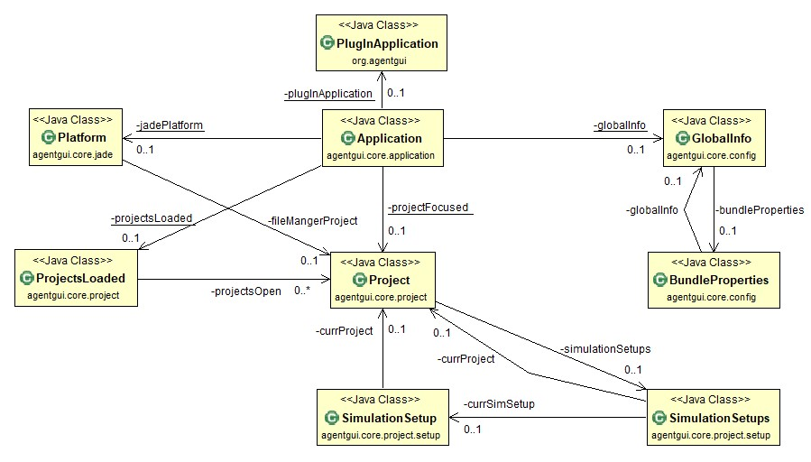

# Operational Main Classes

This page provides an overview of the most important classes of Agent.Workbench and their relationships.

**Application** \(agentgui.core.Application\) ****

The Application class is the core of Agent.Workbench. It contains the application's main-method, and consequently manages the start of the application. As a central class in Agent.Workbench it also provides access to the GlobalInfo class, which provides general application information or controls the JADE agent platform through its jadePlatform attribute. The Application class is designed as singleton,  to make sure the same instance is accessible from every context of the program.

**PlugInApplication** \(org.agentgui.PlugInApplication\)

The PlugInApplication class implements the IApplication interface, which defines the entry point of an Eclipse RCP application. Thus it is responsible for starting and stopping Agent.Workbench, and performing some OS-specific start-up tasks before passing control to the main method of the Application class.

**GlobalInfo** \(agentgui.core.config.GlobalInfo\)

The GlobalInfo class contains several settings, constants and variables that can be accessed application wide, like directory paths and site URLs, as well as enumerations of constants like the different execution \(APPLICATION, SERVER, DEVICE\_SYSTEM,...\) or visualisation modes \(TRAY\_ICON, NONE\). The GlobalInfo instance can be accessed through the Application class.

**BundleProperties** \(agentgui.core.config.BundleProperties\)

The BundleProperties class manages the storage of the application configuration data, which is persisted in the &lt;ApplicationRoot&gt;/configuration/.settings/org.agentgui.core.prefs file in a human readable form \(key value structure\), and thus can also be modified with a text editor.

**Platform** \(agentgui.core.jade.Platform\)

The Platform class manages the interaction between Agent.Workbench and the underlying JADE platforms. It provides methods to start and stop JADE, as well as methods for managing agents and containers.

**Project** \(agentgui.core.project.Project\)

The Project class holds all necessary information about an Agent.Workbench project. In order to allow multiple access to the instance of a project, it is designed in the common MVC \(Model-View-Controller\) pattern. A project contains one or more simulation setups \(see below\)

**ProjectsLoaded** \(agentgui.core.project.ProjectsLoaded\)

The ProjectsLoaded class holds a list of the Project objects that are currently opened inside Agent.Workbench, and provides some methods for managing them.

**SimulationSetup** \(agentgui.core.project.setup.SimulationSetup\)

The SimulationSetup class represents a project simulation setup. Every SimulationSetup object is related to one project and is stored in the project's SimulationSetups object.

**SimulationSetups** \(agentgui.core.project.setup.SimulationSetups\)

The SimulationSetups class contains and manages all setups of a specific project.

