# Create an Agent Project

## What is an Agent Plug-in, what an Agent Project?

This section shortly describes how you can define, develop and start your first agent-based "application". Even this is a very simple example, it will demonstrate the principle on how you can extend Agent.Workbench (AWB) with your own agents and further user functions. Since AWB is based on OSGI / Eclipse _bundles_, you have to develope OSGI _plug-ins_ for your agent projects too. In the course of the text we are mixing-up these terms from time to time, but their meaning is the same (plug-in = bundle). For further reading and a practical introduction into the modularity concept of OSGI, we recommend to read this tutorial: [http://www.vogella.com/tutorials/OSGi/article.html.](http://www.vogella.com/tutorials/OSGi/article.html)

**Eclipse Projects & Agent.Workbench Projects**: We would like to mention here that, in the context of Agent.Workbench and Eclipse, the word "project" is used with two meanings. Since Agent.Workbench handles agents or Multi-Agent Systems (MAS) as self-containing projects on one hand site, also Eclipse uses the term "project" for Java or plug-in developments. This, in turn, makes it sometimes misleading, if we speak about an "agent project" in general. More precisely, we have to distinguish these project types to avoid a lingusitic misunderstanding.

As a prerequisite, we assume that you have an installed Agent.Workbench and an Eclipse IDE (**I**ntegrated **D**evelopment **E**nvironment) that enables you to develop plug-ins (an IDE that enables Java developments only, wil not be sufficient). For further details see the [Getting Started](installations.md) tutorial.

In short words: Our goal here is to create an Eclipse-Plug-in and a first agent, start and debug this agent from the Eclipse IDE and finally, to export the developed agent into a Agent.Workbench project so that the agent application can work on its own (without the IDE). For this the following steps are to be done:

* Create a new Plug-in-Project in the Eclipse IDE.
* Create an Agent: Define your desired package structure and create your first agent class.
* Define a Debug-Configuration
* Debug an Agent:
* Export your agent bundle / plugin into the workbench's project directory and Agent.Workbench standalone. Open the above defined workbench project and have a look at the tabs \[Resources] and \[Agents], where you will find your exported bundle and your first agent.
* Define a setup and start your agent application.

## How can I create own Agents?

With the goal in mind, to develop your own agent-based application, the first step to do so is developing your own agents. Because Agent.Workbench is OSGI based, your extensions to it (your own agents) also need to follow this approach. So in the following, we are going to create a plug-in/OSGI bundle for a dummy agent to demonstrate the process. We want to create the agent, start it with Agent.Workbench and let it print "Hello world!" to the console.

The following steps require you to...

* ... have an Eclipse IDE installed that enables you to develop Plug-ins ( Eclipse IDE for Enterprise Java Developers)
* ... have [defined a target platform](define-a-target-platform/)
* ... have Java version 8 (the 64 Bit version) installed and the Eclipse preferences for jre and compiler set to java 1.8

The source code for this example , as well as for other examples, is stored in a corresponding examples- project in our GitHub that you can find [here](https://github.com/EnFlexIT/AgentWorkbench/tree/master/eclipseProjects/org.agentgui/examples/de.enflexit.awb.samples.Examples).

In the course of this tutorial, we need to create several files in our plug-in. Each file has a reference to its code in our GithHub. In case you cloned Agent.Workbench from GitHub to your Eclipse IDE workspace, you can just copy and paste these files to the location you need it to be, and do some minor changes to it.

### Creating a "Hello world!" agent

Create a new Plug-in Project in Eclipse under _File_ > _New_ > _Plug-in Project_.

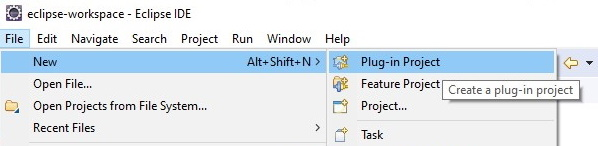

Name the project "de.agent.test". The other text fields and check-boxes can maintain their default configuration. Click _Next_ and then _Finish._

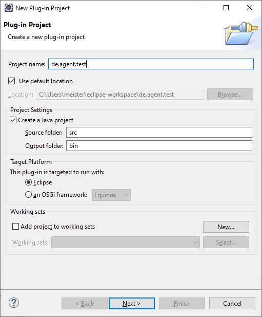

Your plug-in now appears in your Project Explorer tab on the left. If you go into the plug-in hierarchy, you can see the _JRE Systems Library_ which contains multiple _.jar_ files, an empty _src_ folder and a folder called _META-INF_. This stores the _MANIFEST.MF_ file which is part of every plug-in. The file is important because it defines which dependencies your plug-in has, and which packages it exports.

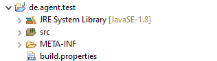

The behavior of an agent is defined in a java class, that represents the agent. Thus, any agent class needs to extend the super class _jade.core.Agent_. This class is part of the JADE bundle _org.agentgui.lib.jade_ that is part of Agent.Workbench. To use it, we have to define this library as a dependency for our plug-in. Therefore, we have to edit the _MANIFEST.MF_ in the Eclipse _Plug-in Manifest Editor_ and choose the _Dependencies_ tab at the bottom of the view. Because we depend on multiple plug-ins throughout this tutorial, for convenience we are going to add them all in this step. Click _Add_ and select the following bundles as Dependencies:

* _de.enflexit.api_
* _de.enflexit.common_
* _org.agentgui.core_
* _org.agentgui.lib.jade_

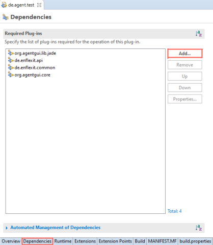

The bunlde _org.agentgui.lib.jade_ contains the above mentioned agents super class, _org.agentgui.core_ and _de.enflexit.common_ are necessary for the class- load service that we are going to address later. The \_de.enflexit.ap\_i plug-in contains some helper classes.

Next we want to create a package, to store our agent class. Right-click the _scr_ folder and choose _New_ > _Package_. Maintain the generated package-name and click Finish.

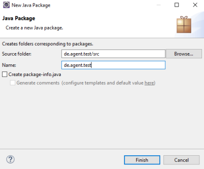

To create the agent class, right-click the _de.agent.test_ package and choose _New_ > _Class_. In the appearing window name the class "HelloWorldAgent" and click _Finish_.

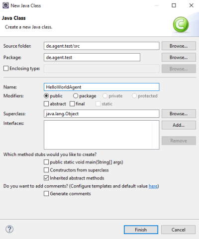

You can find the code for the HelloWorldAgent class [here ](../../../../eclipseProjects/org.agentgui/examples/de.enflexit.awb.samples.Examples/src/de/enflexit/awb/samples/example01/HelloWorldAgent.java)in our GitHub. In your code, you just need to change the specified package, in which the class is stored. You can quick fix this problem by moving your mouse over the specified line and choosing _Change package declaration to "de.agent.test"_. This also applies to all following occasion, where we copy source code from GitHub.

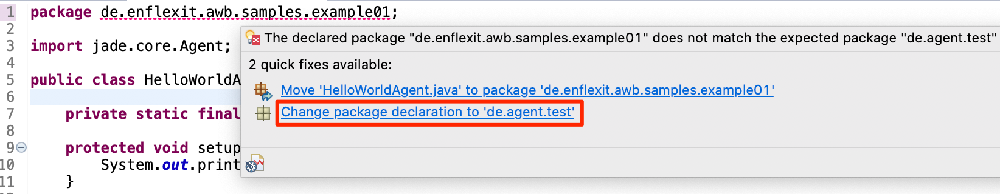


What the HelloWorldAgent class does, is it overrides the setup() method from the _Jade_ agent class to perform certain actions during startup of the agent. In our simple case we just want our agent to print "Hello world!" to the console.


At this point we implemented the core of our hello-world agent plug-in. In the next steps we are going to define the exported packages and adapt OSGI specifications.

Every plug-in that extends Agent.Workbench needs to offer a specific service, the class-load service. The class-load service is connected to a class called _ClassLoadServiceImpl_. To store the corresponding _ClassLoadServiceImpl_ class we create another package in the _scr_ folder, named "de.agent.test.classLoadService". In that package, create a new class called "ClassLoadServiceImpl". You can find the class code [here](../../../../eclipseProjects/org.agentgui/examples/de.enflexit.awb.samples.Examples/src/de/enflexit/awb/samples/classLoadService/ClassLoadServiceImpl.java).

To export the packages and thus make them accessible for other components, we need to adjust the _MANIFEST.MF_ file in the _Runtime_ tab. Under _Exported Packages_, click _Add._

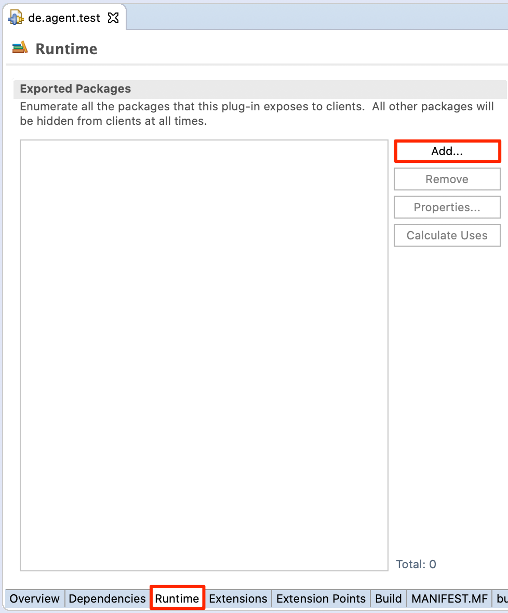

Select the two packages and _Add_ them.

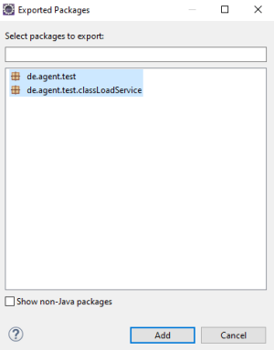

Since our plug-in has to be an OSGI bundle, it needs to comply some OSGI specifications. So to offer the class load-service OSGI conform, we must create a folder in our plug-in called "OSGI-INF" and then store a file called _classLoadService.xml_ in it. To create the folder, right click _de.agent.test_, choose _New_ > _Folder_. To create the XML file, right-click the _OSGI-INF_ folder and choose _New_ > _File_. Name the file "classLoadService.xml".

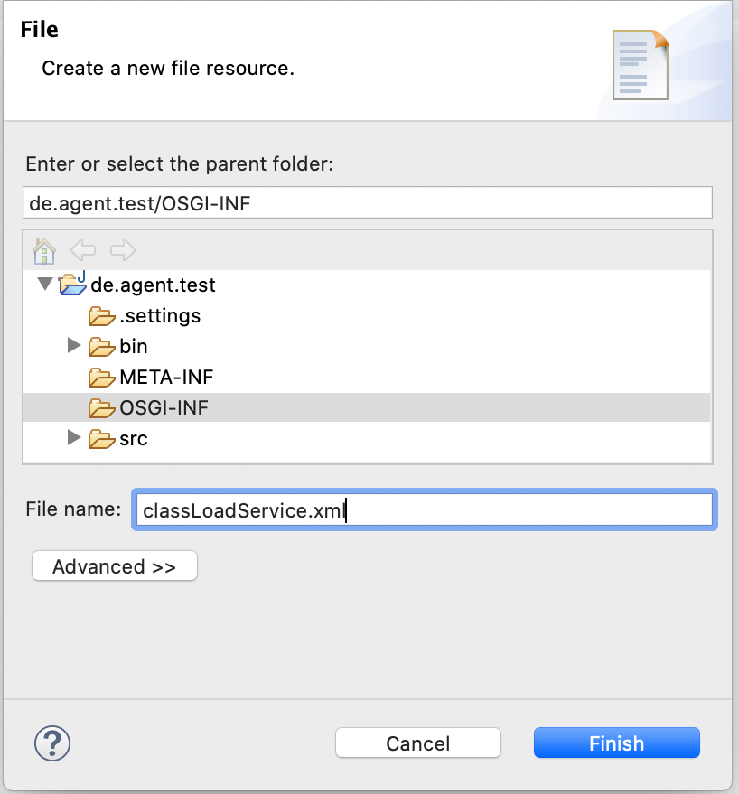

Get the [code for this file](../../../../eclipseProjects/org.agentgui/examples/de.enflexit.awb.samples.Examples/OSGI-INF/classLoadService.xml) from our GitHub and paste it to the _Source_ tab, then save the file.

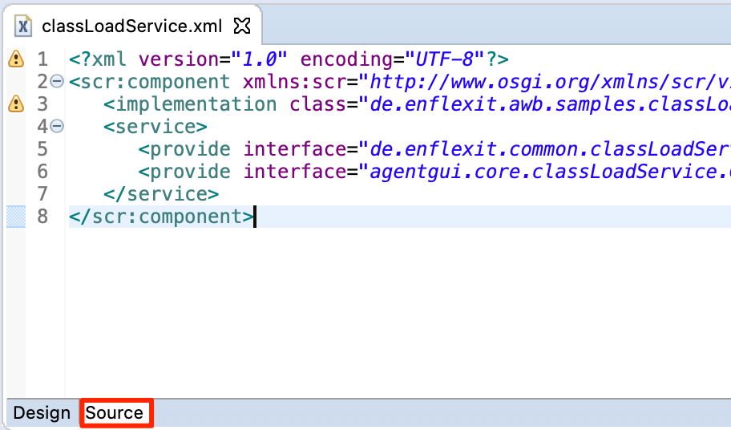

To see changes to the file, close and reopen the file or refresh (F5) the project. As a result an _Overview_ tab appears.

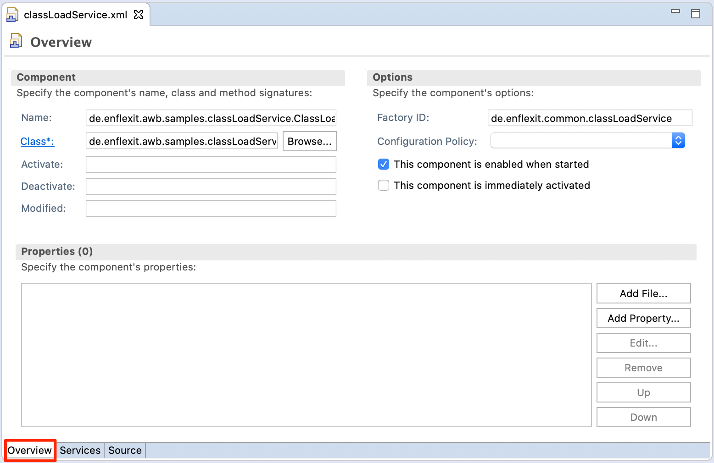

The _Name_ and the _Class_ property specify the location for the _ClassLoadServiceImpl_ class. Since our package structure differs from its original location, we have to set both, _Class_ and _Name_ property to "de.agent.test.classLoadService.ClassLoadServiceImpl".

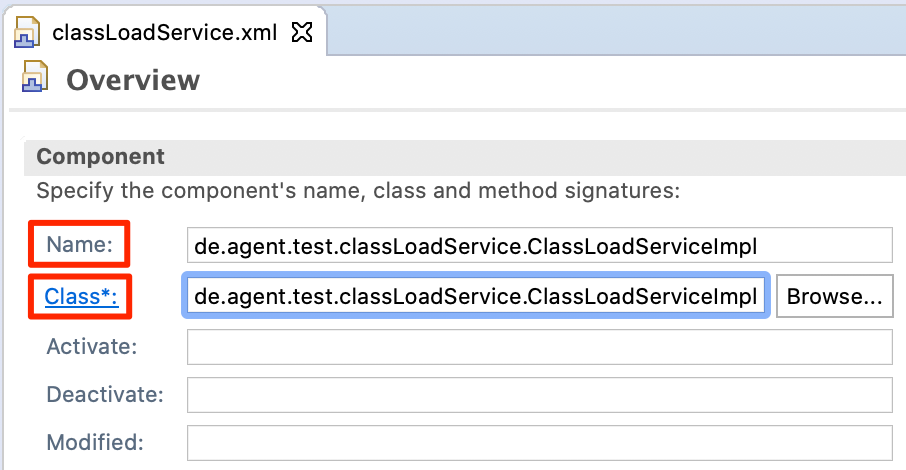

Another OSGI specification requires us to add some OSGI specific headers to the _MANIFEST.MF_ tab, in the _MANIFEST.MF_ file. More precisely, we have to define our S\_ervice-Component\_ and the _Bundle-ActivationPolicy_.

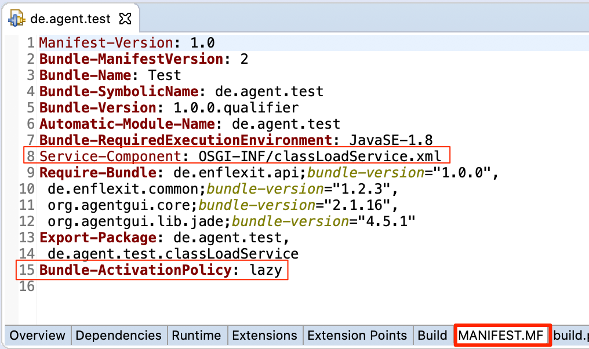

```css
Manifest-Version: 1.0
Bundle-ManifestVersion: 2
Bundle-Name: Test
Bundle-SymbolicName: de.agent.test
Bundle-Version: 1.0.0.qualifier
Automatic-Module-Name: de.agent.test
Bundle-RequiredExecutionEnvironment: JavaSE-1.8
Service-Component: OSGI-INF/classLoadService.xml
Require-Bundle: org.agentgui.lib.jade,
 de.enflexit.api,
 de.enflexit.common,
 org.agentgui.core
Export-Package: de.agent.test,
 de.agent.test.classLoadService
Bundle-ActivationPolicy: lazy
```

As a last step, we need to define the folders that must be included in the build. Check the boxes, as shown in the screenshot below, in the _Build_ tab.

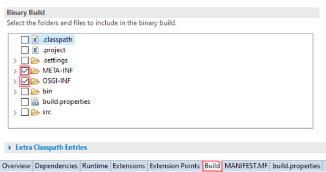

### Starting the agent in Agent.Workbench

Now we created a fully operational agent, that we can use in Agent.Workbench. To demonstrate this, we have to add our _de.agent.test_ plug-in to the run-configuration and start Agent.Workbench with it. As a prerequisite, you should have [setup a run- configuration](starting-awb-from-eclipse.md#setup-the-run-configuration).

Open your _Debug Configurations_.

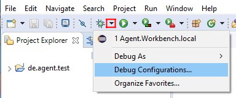

In your _Debug Configurations,_ select your run-configuration and go to the _Plug-ins_ tab. Our plug-in now appears under _Workspace_ > _de.agent.test_. Select the plug-in and click _Debug_ to start Agent.Workbench directly in debug-mode from your IDE.

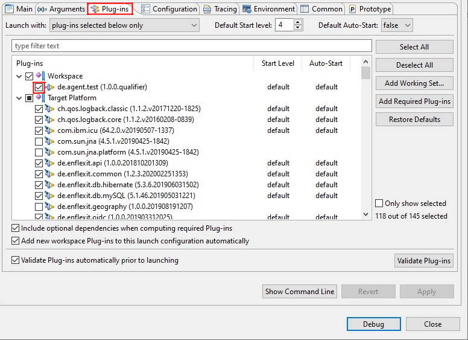

In Agent.Workbench we want to create a new project, called "Hello world" (Instructions on how to create a project in Agent.Workbench can be found on [this](installations.md) page).

In this project, navigate to _Setup_ > _Agent-Start._ Click  , select our agent and click _Add_.

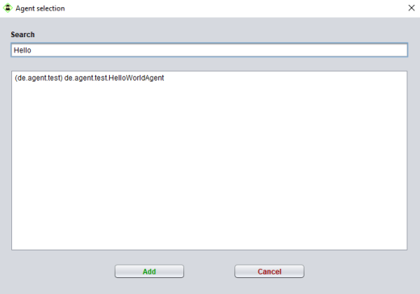

Now our agent (_HeWoAg_) should appear in the start list.

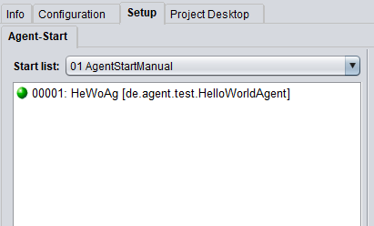

We successfully added our own agent to our project. Now we want JADE to execute our agent, by clicking  . Thereupon two windows will pop up, the _Load Monitor_ and the _Thread Monitor_. Those windows are not important for us at this point, so we can just close them. If we now open the console by clicking  , a console window pops up at the bottom.

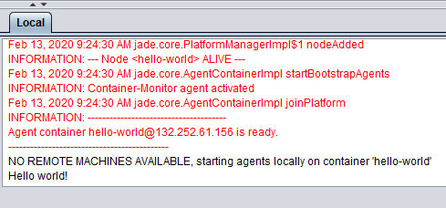

If your console has the line "Hello world!" in it, congratulations! You just created your own, fully functional agent. Now this agent clearly does not deliver any practical benefit. But with completing this tutorial, you learned the basic skill of creating individual agents, and did the first steps any project developer does.

Assuming that our hello- world agent and Agent.Workbench represent a finished project, the next step is to export the project to make it a standalone end-user application.
