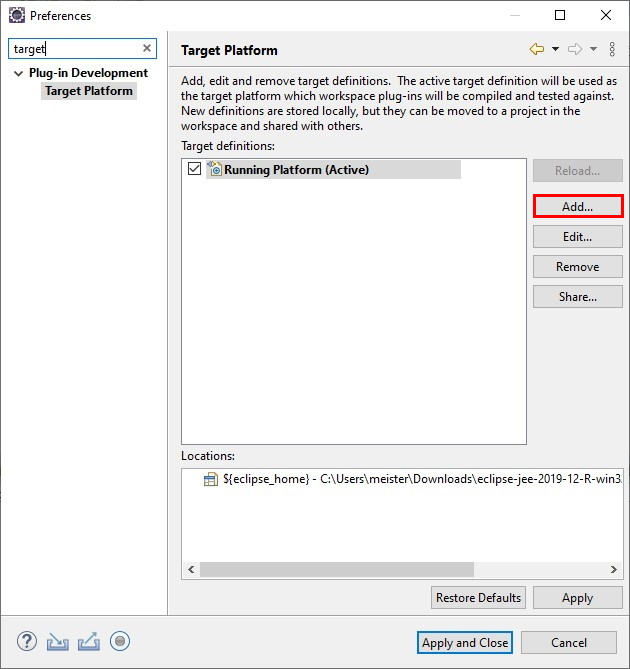
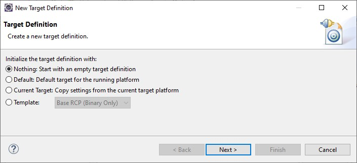
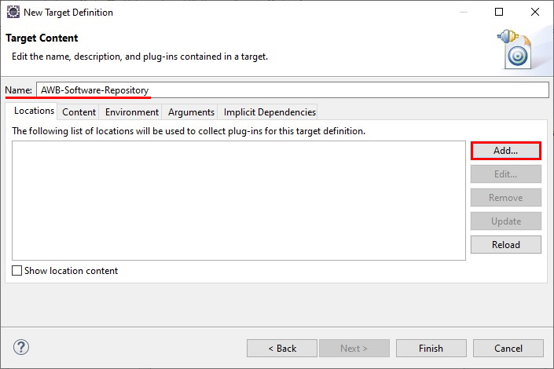
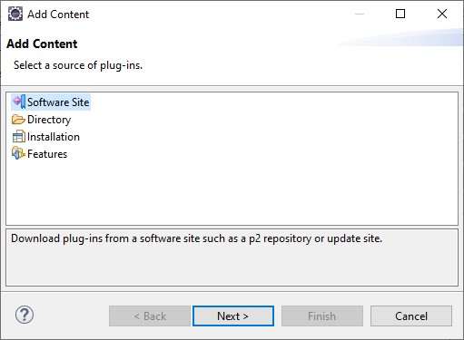
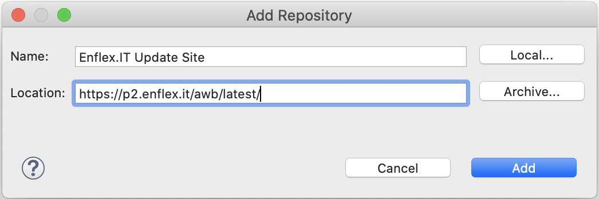
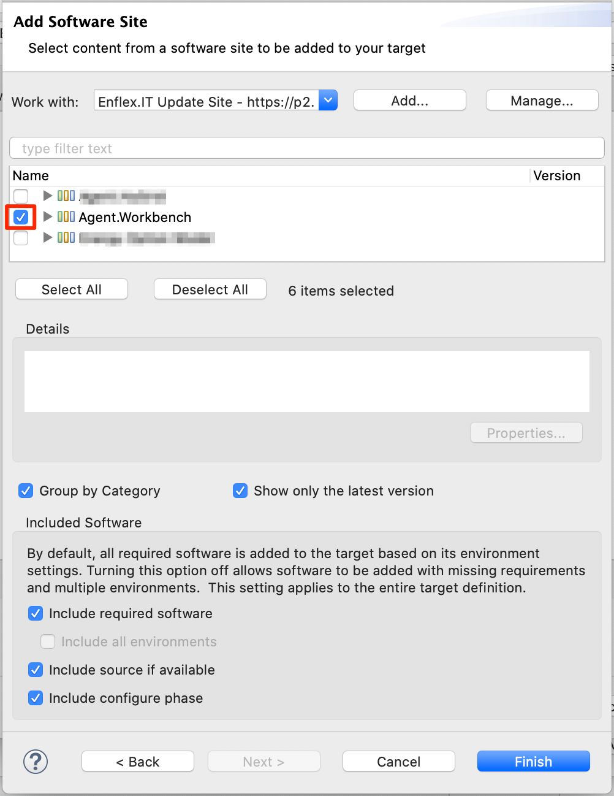
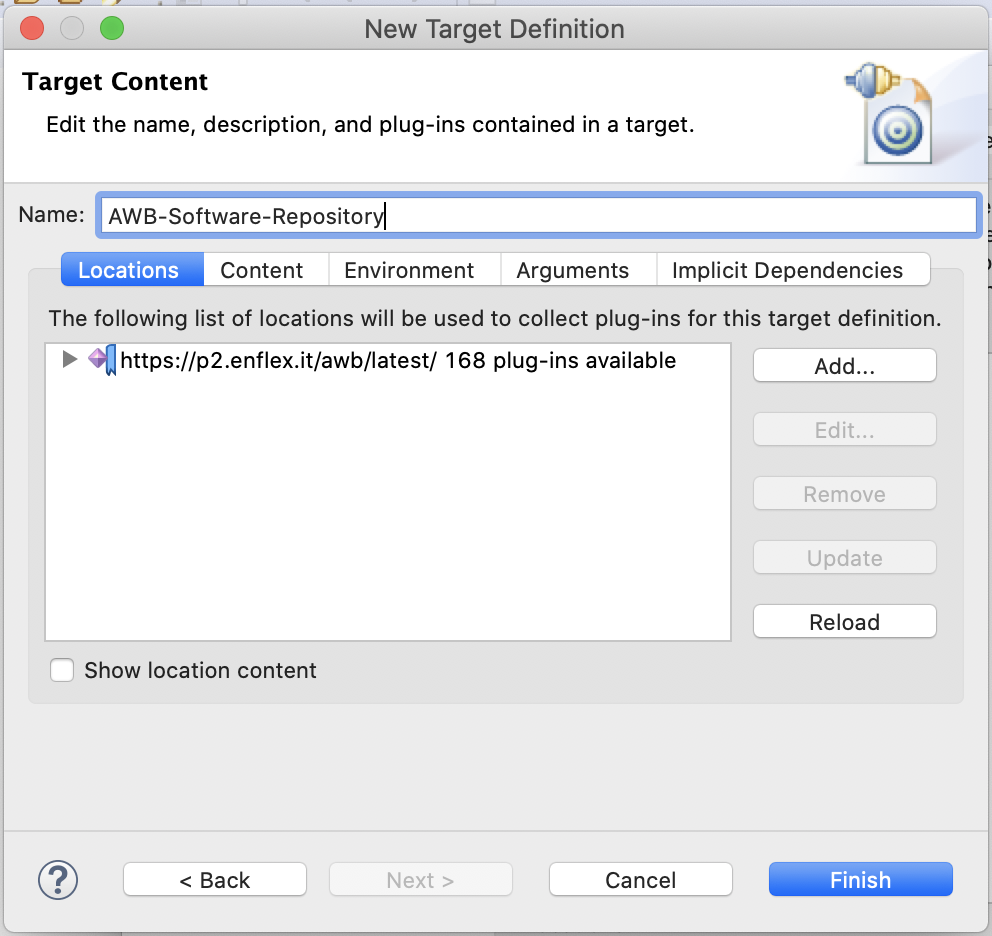
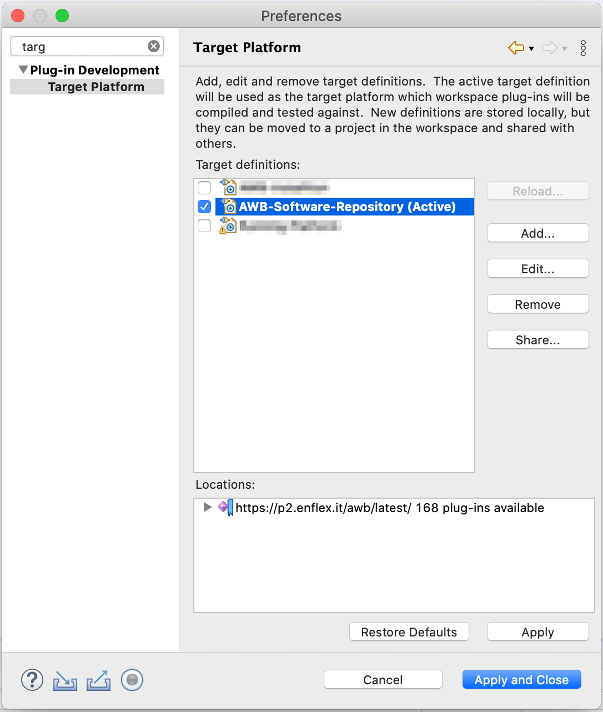

# ... based on AWB-Repository

This tutorial demonstrates how to define a target platform based on the Agent.Workbench Software-Repository.

In your Eclipse IDE, go to _Window_ &gt; _Preferences_. In the top left corner, type "target" to the search field and choose _Target Platform_ from the explorer on the left. In the _Target Platform_ window click _Add_.

Choose _Nothing: Start with an empty target definition_. Then click _Next_.

Name your target platform \(e.g "AWB-Software-Repository"\). Add a location for the target definition by clicking _Add_.

In our case, the location for the Agent.Workbench library is a remote software-repository. Select _Software Site_ and click _Next_.

If not already in the list of the '_Work with:_' combo box in the next dialog, _Add_ a new repository to the known repositories. Give the repository a name \(e.g. _**Enflex.IT Update Site**_ - see below\). The location for  the software repository is: _**https://p2.enflex.it/awb/latest**_**/**  
Finally click _Add_.

On the next page, we need to select at least the group called _Agent.Workbench._ Beside, and depending on your development tasks, you are free to select further features from the repository. Then click _Finish_.

To complete the process to define your target platform, click _Finish_.

In the Preference window, select _Apply and Close_.

We now successfully defined a target platform based on the AWB Software-Repository. With this target platform, we can now start Agent.Workbench from the Eclipse IDE. A tutorial on how to do this can be found [here](../starting-awb-from-eclipse.md).

