# ... based on AWB-Sources

This tutorial aims to show AWB developers how to import Agent.Workbench to the Eclipse IDE and setup the run configuration. To avoid any problems, there are some prerequisites for completing this tutorial:

* This tutorial uses the [Eclipse IDE for Java EE Developer.](https://www.eclipse.org/downloads/) To follow along, we recommend to also install Eclipse.
* Java version 8 must be installed and the Eclipse preferences for jre and compiler are set to java 1.8.

## Import Agent.Workbench to the Eclipse IDE

### Clone Agent.Workbench Repository from GitHub

Go to the Agent.Workbench [GitHub site](https://github.com/EnFlexIT/AgentWorkbench). Click Clone or download and copy the link.

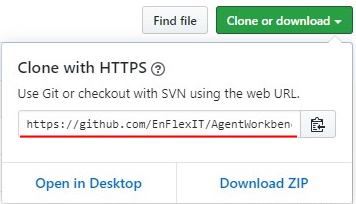

Now open the Eclipse IDE. In Eclipse it is recommended to use to use the Plug-in Development Perspective. You can change the Perspective under Window &gt; Perspective &gt; Open Perspective  &gt; Other... &gt; Plug-in Development.

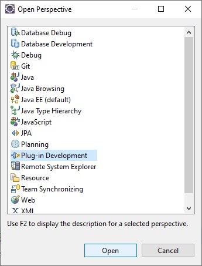

Now we can clone Agent.Workbench directly from inside the Eclipse IDE with the _Git Repositories_ view. To add this view to your Perspective, go to Window &gt; Show View &gt; Other... &gt; Git &gt; Git Repositories.

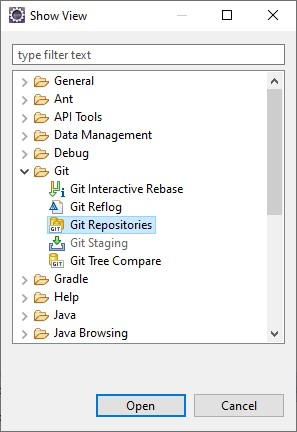

Open the _Git Repositories_ tab at the bottom and click _clone a Git repository_. Then follow the wizard. 

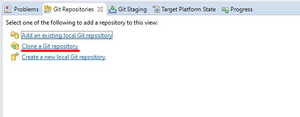

Paste the repository link from GitHub to the _URI_ text field. Click _Next_.

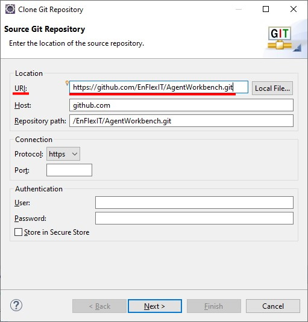

Make sure to only select the master branch. Click _Next_.

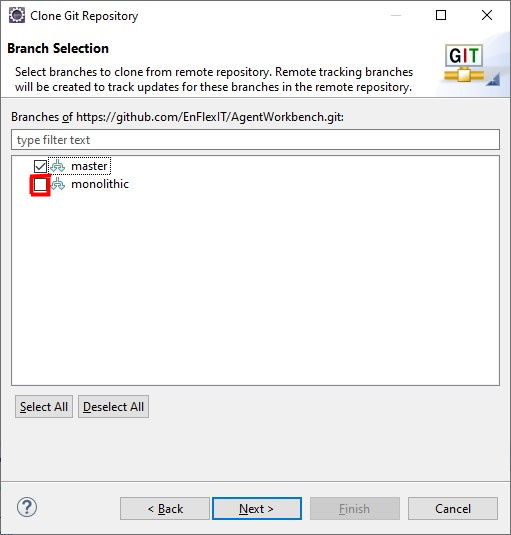

Specify the directory where you want to save the local repository. Make sure to **not** import all existing projects. We don't need all projects and will select them manually. Click _Finish_.

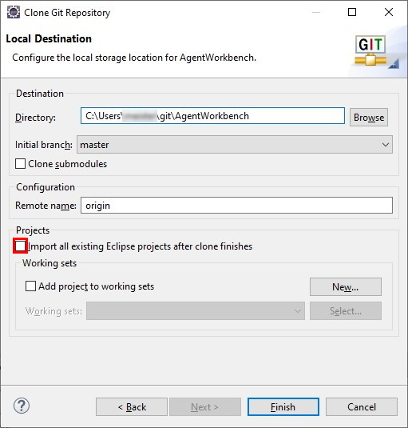

After completing the wizard, Eclipse downloads a local copy of the Agent.Workbench repository and displays it in the _Git Repositories_ view.

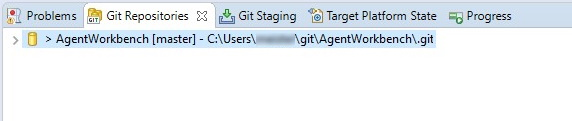

### Import the bundles to the workspace

To get the bundles into the Eclipse workspace, we need to import them from the location, where we stored the local copy of the Agent.Workbench repository. Therefore right-click the Agent.Workbench repository and choose _Import Projects_. 

The repository contains bundles, that we don't want to import. By default, all the bundles are selected, so we have to manually deselect the following:

1. The AgentWorkbench bundle at the top
2. **All** bundles which are imported as Maven

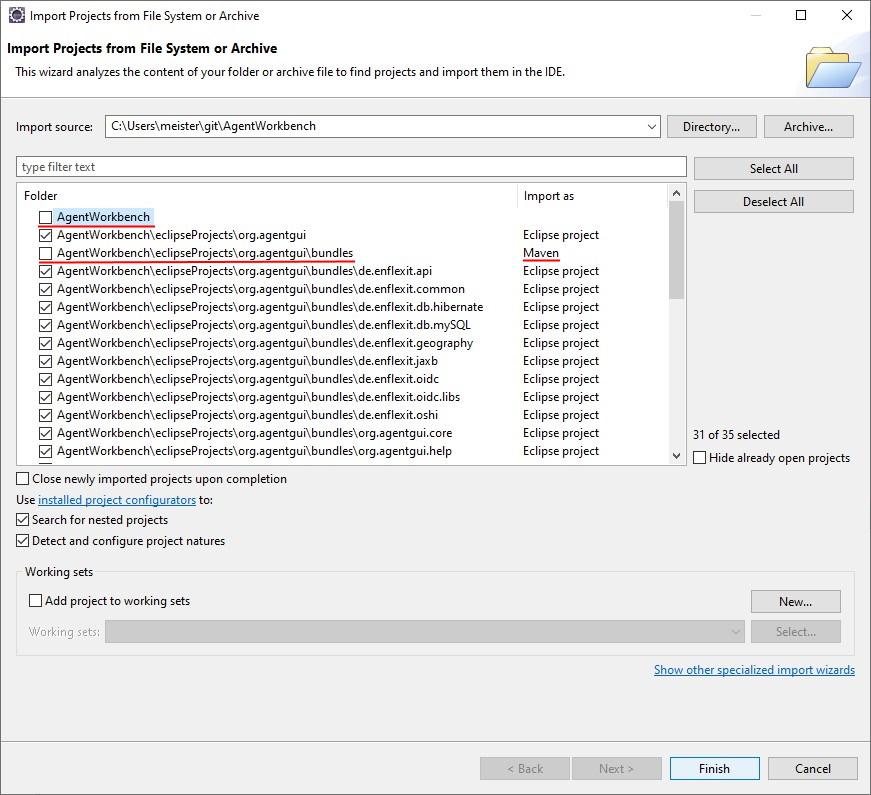

Then click _Finish_. After importing the bundles, Agent.Workbench should appear as a project in the Project-explorer on the left.

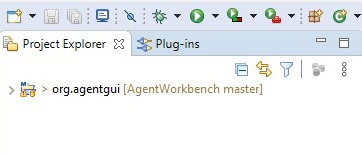

If the Project Explorer displays the project as a list of bundles, change the _Project Presentation_ to _Hierarchical_.

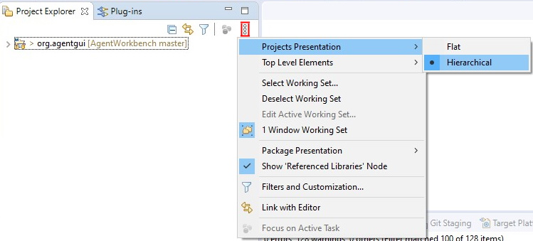

### Problems after importing the bundles

In some cases, an Error occurs in the project after importing the bundles from the local repository.  The Errors of type _"Plugin execution not covered by lifecycle configuration: ..."_ are known and don't impact the behavior of Agent.Workbench, so we can just delete them \(right-click &gt; _Delete_\).

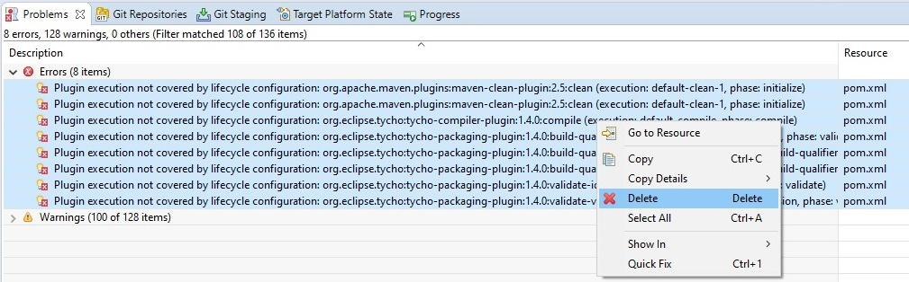

