# ... based on AWB-Installation

## Define the Target Platform

To do so, open the Eclipse preferences \(menu _**Window**_ =&gt; _**Preferences**_\) and type the word 'target' into the search text field \(see image\).

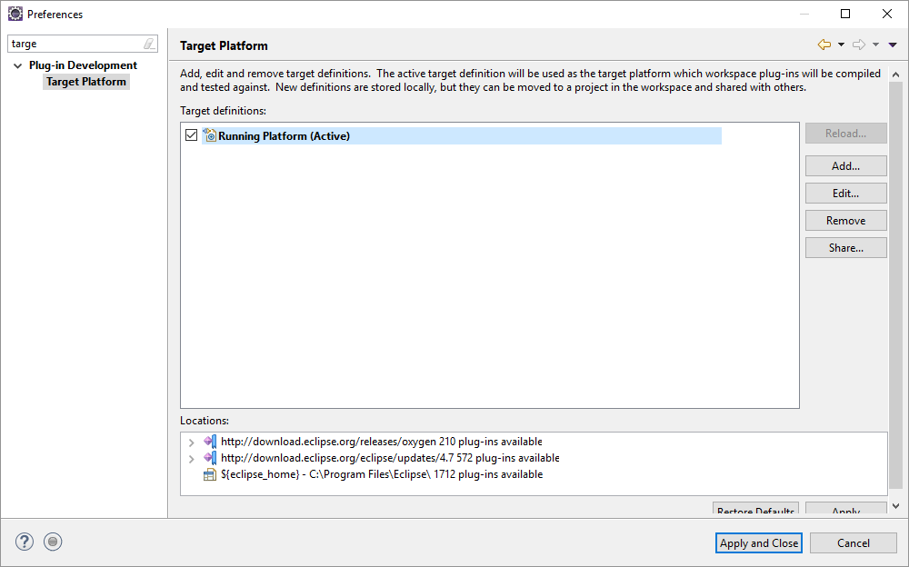

Further, _**Add**_ a new Target Platform definition, choose **Nothing: Start with an empty target definition** on the first dialog page and press the _**Next**_ button underneath. In the subsequent dialog:

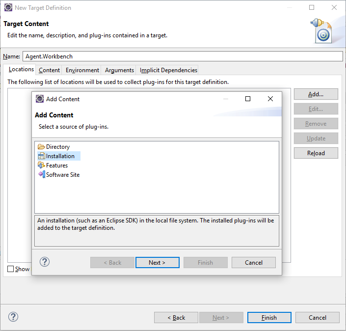

1. Define the name of the Target Platform definition \(e.g. Agent.Workbench\)
2. Choose _**Add**_ to select the content \(bundles and / or features\) that define your target platform.
3. Select _**Installation**_, press _**Next**_ and _**Browse**_ to the installation of Agent.Workbench in your file system.
4. Again, click _**Next**_ to get a preview of the bundles / plugins to be used for your Target Platform or directly click _**Finish**_.

As a result, the field in the _**Locations**_ tab should point to your Agent.Workbench installation, saying that approx. 131 plugins were found. Click on _**Finish**_**.** The new target platform definition should now also be displayed in the list in the preference dialog. As final step mark this new definition as active \(_**tick the corresponding box**_\) and press _**Apply and Close**_.

Now you are prepared to develop your first agent project with Agent.Workbench.

## Install the Developer Resources

When defining the target platform based on a local AWB installation, by default you cannot see the AWB source code. In case you are a developer who wants to read the source code, you can simply download those resources from your AWB installation.

Open the AWB installation that you defined your target platform with. Then click _Help_ and open the _Eclipse Window_.

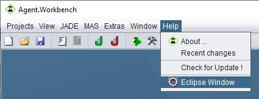

In the Eclipse Window, click _Help_ and _Install New Software_.

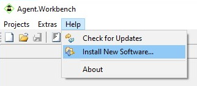

In the drop-down menu select the _EnFlex.It Update Site_. 

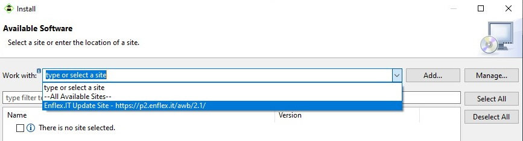

To follow along, check _Group items by category_, then open Agent.Workbench and select _Agent.Workbench - Core Feature Developer Resources_ and _EnFlex.IT common interfaces_ and _classes Developer Resources._ Then click _Next_.

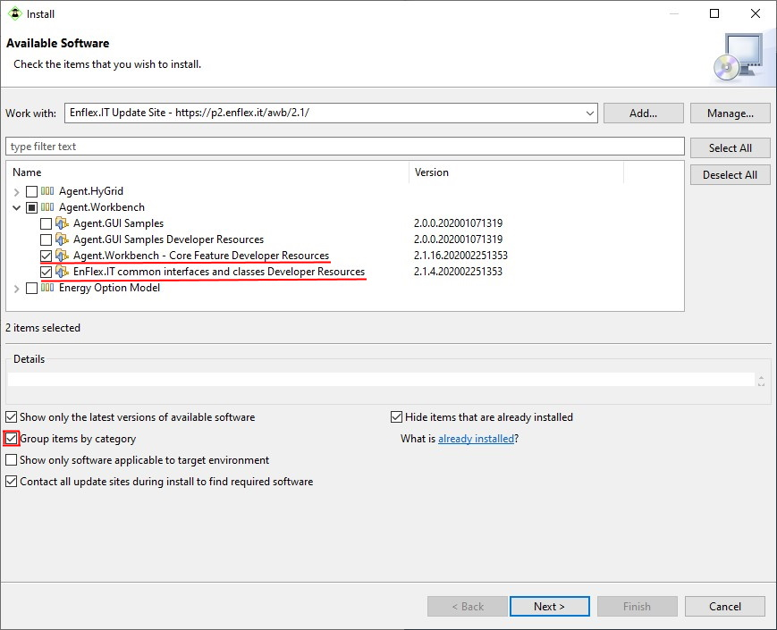

Review the items to be installed and click Next.

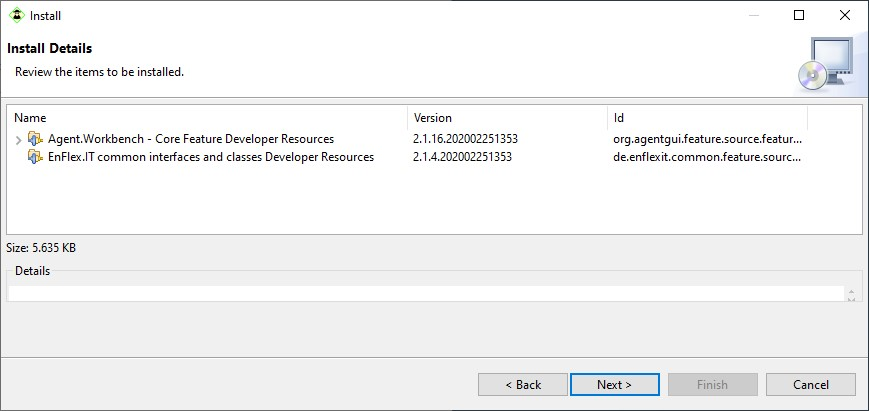

On the next page, accept the license agreement and click _Finish_. If a security warning shows up, click _Install anyway_.

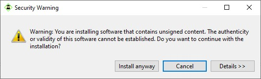

Then restart Agent.Workbench.

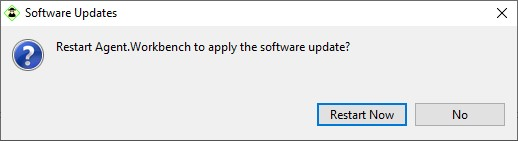

Now you successfully installed the Developer Resources. As a last step, because we made changes to the AWB installation that Eclipse does not know about, we must reload the target platform. Open your target platform definition and click _Reload_.

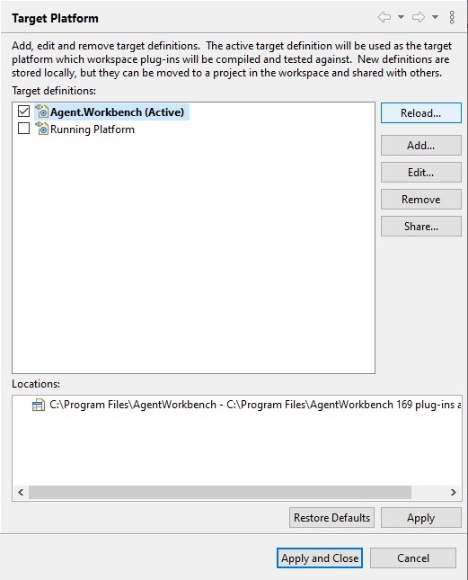

## Uninstall Developer Resources

If you want to uninstall previous installed Developer Resources, open the Eclipse window in your AWB installation again. Then click _Help_ &gt; _About_.

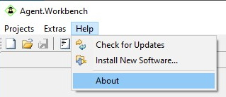

Then open the _Installation Details_.

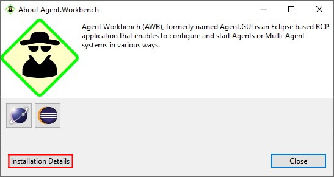

In the Installation Details window select the resources you want to uninstall and click _Uninstall_.

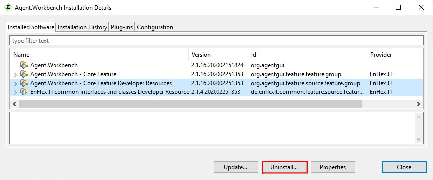

On the next page confirm the uninstallation by clicking _Finish_.

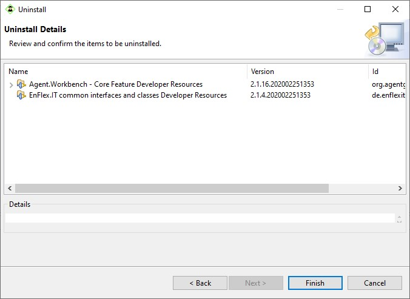

After restarting Agent.Workbench the resources are uninstalled. As a last step you have to reload the target platform in Eclipse again, as explained [above](target-platform-based-on-awb-installation.md#install-the-developer-resources), to get the changes in your Eclipse workspace.

