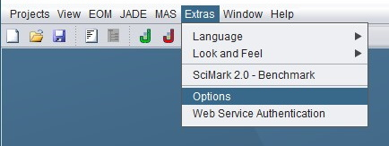
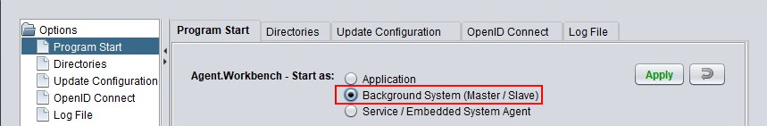
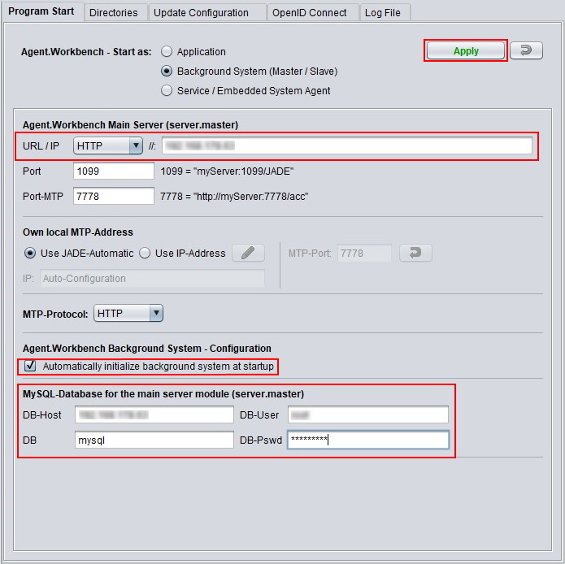
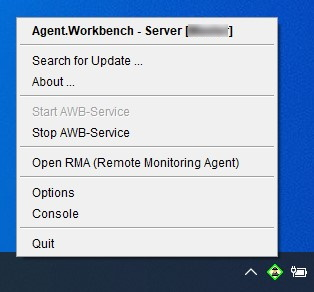

# The Background System

## Introductory remarks

This page describes the different parts of the background systems and gives instructions on how to configure it. It needs to be mentioned that, although the background system is intended to be used in a network of machines, all steps can also be performed on a single machine, where multiple Agent.Workbench instances run simultaneously as different background system agents. However, the background system requires a connection to a MySQL database. So make sure that an appropriate MySQL database server is available in the underlying network \(or on your machine\) and grant access to create a new database is given.

## Why distribute agents?

Distributing the agents of your JADE Multi-Agent System dynamically over several machines is useful if they exceed the computing power of your local machine, be it due to a large number of agents or because specific agents cause a high workload, or if the required computing power is not known in advance. In those cases, the Agent.Workbench background system is able to automatically distribute agents from a running project/end-user application.

## How does the Background System work?

The Background system formed by several \(physical or virtual\) machines and thereon executed  administrative agents - one _server.master_ agent, one or several _server.client_ agents and one or several _server.slave_ agents. These agents provide a dynamic start and load balancing process that is capable of dynamically extending the JADE platform with new agent containers and distribute agents according to the available resources.

#### server.client

The server.client agent is running on the platform that is started with the Agent.Workbench end-user application. If a distribution of agents is necessary, the server.client agent forwards a corresponding request to the server.master agent.

#### server.master

The server.master is the interface between the server.client and the server.slaves. A connection to a server.master is mandatory for every project/end-user application that wants to make use of the background system. The server.master is responsible for processing the incoming requests from the server.client. When demanded by the server.client, the server.master requests a server.slave to create a new JADE container. It also keeps track of all available background agents and their current load and available resources in a connected database. Every background agent has to register itself to the server.master and continuously reports the state of its corresponding machine to it. 

#### server.slave

A server.slave is a passive agent, typically running on a remote machine inside the background systems network. When requested by the server.master, a server.slave creates a new JVM and a remote JADE container to extend the platform and execute the agents that are assigned to it from the load balancing process.

## Set up the Background System

To setup the background system, open Agent.Workbench and go to _Extras &gt; Options_.

In the _Program Start_ tab select _Start as: Background System \(Master/ Slave\)_. This mode allows the current Agent.Workbench instance to either start as a server.master or a server.slave.

If your machine acts as master or slave depends on the server.master location you specify by its URL or IP. To act as master, point to your local machine. If you specify the URL or IP of an existing server.master, your local instance will register to it and act as a server.slave. The port settings must match those of the server.master - usually it will be the default ports 1099 and 7778.

If configuring a server.master, a valid MySQL database must be specified to store administrative information. The MySQL settings can be found at the bottom of the options pane. Please specify the location of the MySQL server and the name of the database you want to use, as well as the credentials of a user who has the necessary permissions to read and write data and create tables in the specified database. The necessary database schema \(table structure\) will be created automatically if not already present.

Make sure to check the box for _Automatically initialize background system at startup_. Then click _Apply_ to switch to server mode, which triggers a restart of the application. The server mode has no end-user GUI. It can be controlled via the context menu of the Agent.Workbench tray-icon.

Now you know the steps for creating server.master/server.slave instances and thus create your own background system.

