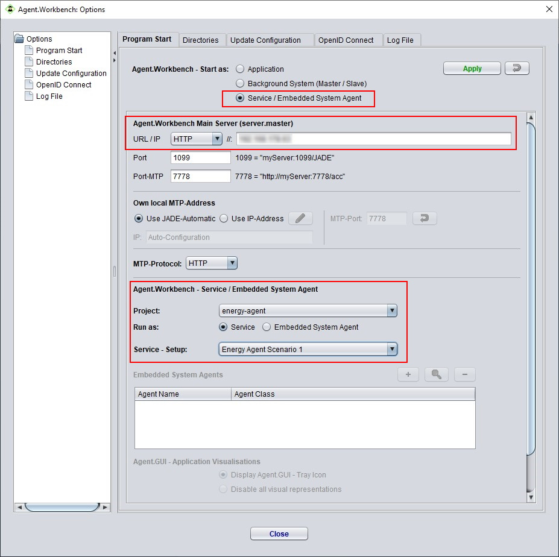

# AWB Execution Modes

Agent.Workbench provides four different execution modes: End-user _**Application**_, ****_**Background System**_, _**Service**_ and _**Embedded System Agent**_. These modes are suited for different use cases \(simulation/operation\) and offer individual features like direct execution of agents, a user interface \(UI\) etc.

## Introductory remarks 

Agent.Workbench allows you to switch the execution mode anytime. Except for a special setting in the mode _Embedded System Agent_ mode, the tab _Program Start_ in the _Options_ is the central location for this. Depending on the current mode, the _Options_ can be accessed in different ways, which will be explained below. To switch modes, select the desired mode in the top section \(_Agent.Workbench - Start as:_\), specify the required parameters for the specific mode \(see below\), and click Apply to restart Agent.Workbench.

In execution modes _Application_ and _Service_, Agent.Workbench can be connected to a _Background System_. This allows to distribute the JADE agent platform across multiple machines. To do so, specify the location of the so-called _server.master_ by its URL or IP-address. The port settings must match the configuration of the server.master - usually it will be the default ports 1099 and 7778. More details about the _Background System_ and _Server_ configuration can be found [here](distributed-application.md).

## End-User Application

The _End-User Application_ mode is the default. It provides the graphical user interface to create, configure and execute your AWB agent projects. When connected to a _Background System_, agents can be distributed and remote containers can be monitored via the end-user application.

In the _End-User Application_ mode, the _Options_ dialog can be found under _Extras &gt; Options._ Alternatively, as shown further below, you can also use the context menu of the AWB tray icon.

Beside optional settings for the _Background System_ connection, the _Application_ execution mode does not require any further specific configuration. 

## Server / Background System

Agent.Workbench can also be executed in a _Server_ mode that is dedicated to the _Background System_. This mode does not provide a graphical user interface. The only visual representation is the AWB tray icon in the icon tray of the operating system \(if available\). It allows to control the AWB execution by a context menu. This allows the user to perform important actions like opening the _Options_ dialog, showing _Console_ output or starting and stopping Agent.Workbench in the current mode.

The _Server_ mode is connected to the _Background System_. In fact, it is not possible to start an Agent.Workbench instance in _Server_ mode without laying down parameters for the _Background System_. When configured correctly, an AWB instance is either handled as a so called _server.master_, _server.slave_ or _server.client_. These instances can be distributed over several machines and thus create the background system, a network that is in control of dynamically extending the JADE platform with JADE containers. More information about configuring the _Server_ mode, the background system and how to create one is provided on [this page](distributed-application.md).

## Service

In _Service_ mode, Agent.Workbench spares the user to open and start an agent project manually. At startup, Agent.Workbench automatically starts JADE and executes a specified project setup \(direct execution\). The visual appearance of the _Service_ mode is equal to the end-user oriented _Application_ mode.

To utilize the _Service_ mode, you need to specify the project to open, choose _Run as: Service_ and select a  a project setup to execute. The agents specified in the agent start-list of the project setup will be executed directly after pressing the _Apply_ button or the next time you start Agent.Workbench.

## Embedded System Agent

The mode _Embedded System Agent_ is configured similar to the _Service_ mode and also features direct execution of agents. However, at startup only specified agents from a project will be started. In this mode, the visual representation is restricted. The user can choose between a _Server_-like appearance with a tray-icon or a hidden execution, with no visual representation. In contrast to the _Application_ or _Service_ mode, the _Embedded System Agent_ mode is suited for operational purpose, as for example for agents that have to run in an automation environment on an industrial PC or in a Smart House scenario.

To utilize the _Embedded System Agent_ mode, you have to specify a project and choose _Run as: Embedded System Agent_. To specify the agents that you want to execute, for each agent, click the  button and select the desired agent from the list; afterwards, assign a runtime name to the agent. For the visualization you have two options:

#### Display Agent.Workbench - Tray icon

In this mode Agent.Workbench is represented by a tray-icon and can be controlled via the context menu.

#### Disable all visual representation

With this option, Agent.Workbench will be executed completely hidden. The console output is redirected to a log file in the root directory of Agent.Workbench. Also, a file called _**Shutdown\_Service\_EmbeddedSystemAgent\_\[PID\]**_ will be created. This file indicates that Agent.Workbench is running and is permanently observed by a system agent. As soon as this file is deleted, Agent.Workbench \(and JADE\) will shutdown automatically. 

## Configuration File _org.agentgui.core.prefs_

As compensation for the missing Options dialog, the configuration file ._/configuration/.settings./org.agentgui.core.prefs_ can be found in the Agent.Workbench installation. In fact, configuring this file is the same as configuring Agent.Workbench in the Options dialog. It allows you to switch to any execution mode by specifying the necessary parameters, or change the visualization within the _Embedded System Agent_ mode. You can open and edit the file _org.agentgui.core.prefs_ file with any text editor. 

The value for _01\_RUNAS_ specifies the execution mode you want to switch to. Connecting to a _Background System_ is also as straight forward as in the Options dialog. Just type the URL or IP-address of the server.master at _11\_MASTER\_URL_ and so on.

The following table shows the possible values for the _**01\_RUNAS**_ key and explains how the _org.agentgui.core.prefs_ file further needs to be configured to successfully switch an execution mode.

<table>
  <thead>
    <tr>
      <th style="text-align:left">Value</th>
      <th style="text-align:left">Explanation</th>
    </tr>
  </thead>
  <tbody>
    <tr>
      <td style="text-align:left">
        
<b>APPLICATION</b>
        

        
&lt;b&gt;&lt;/b&gt;

        
&lt;b&gt;&lt;/b&gt;

        
&lt;b&gt;&lt;/b&gt;

        
&lt;b&gt;&lt;/b&gt;

      </td>
      <td style="text-align:left">Indicates the usage as <em>End-User Application</em>. Since it does not
        require any mode-specific configuration, this is basically the only parameter
        you need to change.
         If you like to extend and distibute your agent platform over several computer
        systems, specifiy the URL or IP-address of a running server.master instance
        by setting a value to <em>11_MASTER_URL</em>.</td>
    </tr>
    <tr>
      <td style="text-align:left">
        
<b>SERVER</b>
        

        

           
           
        

        

        

      </td>
      <td style="text-align:left">
        
Indicates to execute in the <em>Server </em>mode. Based on the further
          configuration, the instance is either handled as a so-called <em>server.master</em> or
          as <em>server.slave</em>.

        
The <em>Server </em>mode requires to define the URL or IP-address of the <em>server.master</em> system
          at <em>11_MASTER_URL</em>. If you intend to execute a <em>server.master</em> instance,
          you additionally need to specify the values for <em>MASTER_DB_HOST, -NAME, -USER</em> and
          -<em>PSWD</em>.

      </td>
    </tr>
    <tr>
      <td style="text-align:left">
        
<b>DEVICE_SYSTEM</b>
        

        

        

        

        

           
           
           
        

        

        

        

        
<b> </b>
        

        

        

      </td>
      <td style="text-align:left">
        
Indicates the usage of the <em>Service </em>or <em>Embedded System Agent</em> mode.
          Analogue to the <em>Options</em> dialog , it requires further configuration.
          For both execution modes, the key <em>40_DEVICE_SERVICE_PROJECT </em>needs
          to define a valid project out of the current projects directory; the specification
          of the subdirectory is sufficient here (e.g. my-agent-project).

        

        
For the <em>Embedded System Agent</em> mode, key <em>41_DEVICE_SERVICE_EXEC_AS</em> has
          to be set to <b>AGENT</b>. Further, the corresponding agent has to be specified
          under <em>44_DEVICE_SERVICE_AGENT_Name</em>. Finally, choose between <b>NONE </b>(for
          hidden execution) and <b>TRAY-ICON</b> (for tray-icon visualization) for <em>45_DEVICE_SERVICE_VISUALISATION</em>.

        

        
For <em>Service </em>mode, <em> 41_DEVICE_SERVICE_EXEC_AS</em> must be set
          to <b>SETUP</b>. The corresponding setup out of the project needs to be
          specified at <em>42_DEVICE_SERVICE_SETUP</em>
        

      </td>
    </tr>
  </tbody>
</table>For sure, the easiest way to configure Agent.Workbench is to use the Options dialog, since it provides suitable user support functions. For some configurations, as for example for the configuration of so-called device agents, the configuration is more complex \(see example below\). Therefore it can be helpful to use the Options dialog to configure your own configuration examples. Here the example:

44\_DEVICE\_SERVICE\_AGENT\_Name = Agent1\(net.package.MyAgent\), AgentNo2\(net.package.MyAgent\)

The table below gives explanations on the individual lines, that need to be configured properly to switch to _Server_, _Service_ or _Embedded System Agen_t mode.

<table>
  <thead>
    <tr>
      <th style="text-align:left">Key</th>
      <th style="text-align:left">Value</th>
      <th style="text-align:left">Explanation</th>
    </tr>
  </thead>
  <tbody>
    <tr>
      <td style="text-align:left">
        
11_MASTER_URL

        

      </td>
      <td style="text-align:left">
        
myComputerURL

        
or 127.0.0.1

        

      </td>
      <td style="text-align:left">URL or IP address of the server.master. Necessary for connecting to a
        Background System.</td>
    </tr>
    <tr>
      <td style="text-align:left">
        
20_MASTER_DB_HOST

        

      </td>
      <td style="text-align:left"></td>
      <td style="text-align:left">URL/IP address of the DB host for the server.master.</td>
    </tr>
    <tr>
      <td style="text-align:left">21_MASTER_DB_NAME</td>
      <td style="text-align:left"></td>
      <td style="text-align:left">Specifies the name of the database.</td>
    </tr>
    <tr>
      <td style="text-align:left">22_MASTER_DB_USER</td>
      <td style="text-align:left"></td>
      <td style="text-align:left">Specifies the username.</td>
    </tr>
    <tr>
      <td style="text-align:left">23_MASTER_DB_PSWD</td>
      <td style="text-align:left"></td>
      <td style="text-align:left">Password for utilizing the database.</td>
    </tr>
    <tr>
      <td style="text-align:left">
        
40_DEVICE_SERVICE_PROJECT

        

        

      </td>
      <td style="text-align:left"></td>
      <td style="text-align:left">Specifies project name for the <em>Service </em>or <em>Embedded System Agent</em> mode,
        depending on further configuration.</td>
    </tr>
    <tr>
      <td style="text-align:left">
        
41_DEVICE_SERVICE_EXEC_AS

        
&lt;em&gt;&lt;/em&gt;

        
&lt;em&gt;&lt;/em&gt;

      </td>
      <td style="text-align:left">
        
AGENT

        

        

      </td>
      <td style="text-align:left">Specifies the <em>Embedded System Agent</em> mode, if 01_RUNAS is set to
        DEVICE_SYSTEM.</td>
    </tr>
    <tr>
      <td style="text-align:left"></td>
      <td style="text-align:left">
        
SETUP

        

      </td>
      <td style="text-align:left">Specifies the <em>Service </em>mode, if 01_RUNAS
         is set to DEVICE_SYSTEM.</td>
    </tr>
    <tr>
      <td style="text-align:left">
        
42_DEVICE_SERVICE_SETUP

        

        

      </td>
      <td style="text-align:left"></td>
      <td style="text-align:left">Specifies the project setup, and thus the agent-start list, that is utilized
        in <em>Service </em>mode.</td>
    </tr>
    <tr>
      <td style="text-align:left">
        
44_DEVICE_SERVICE_AGENT_Name

        

      </td>
      <td style="text-align:left">
        
(see above)

        

      </td>
      <td style="text-align:left">Specifies the agent that is executed in <em>Embedded System Agent</em> mode.</td>
    </tr>
    <tr>
      <td style="text-align:left">45_DEVICE_SERVICE_VISUALISATION</td>
      <td style="text-align:left">TRAY-ICON</td>
      <td style="text-align:left">Enables a tray-icon in <em>Embedded System Agent</em> mode, thru which Agent.Workbench
        can be controlled.</td>
    </tr>
    <tr>
      <td style="text-align:left"></td>
      <td style="text-align:left">NONE</td>
      <td style="text-align:left">Disables all visualization in <em>Embedded System Agent</em> mode.</td>
    </tr>
  </tbody>
</table>

