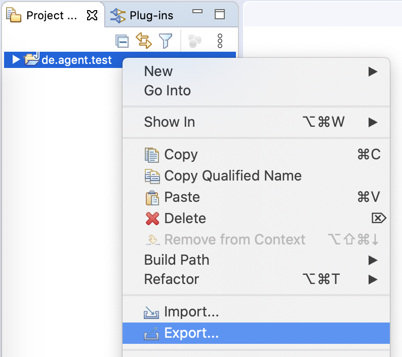
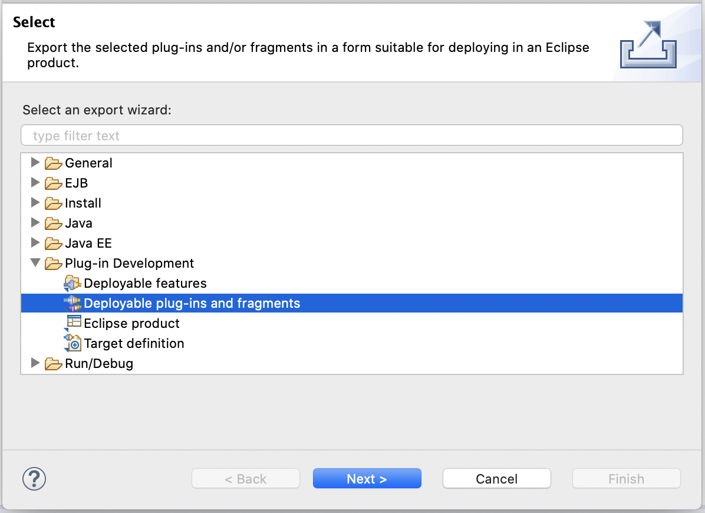
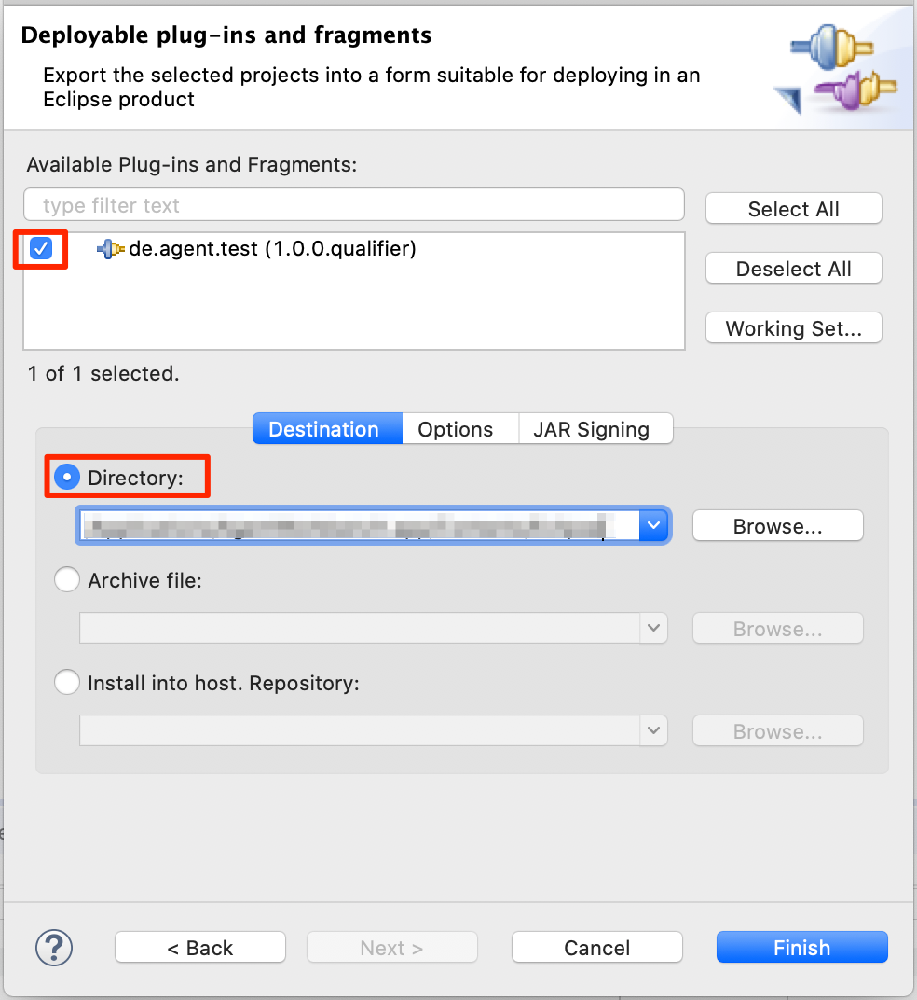
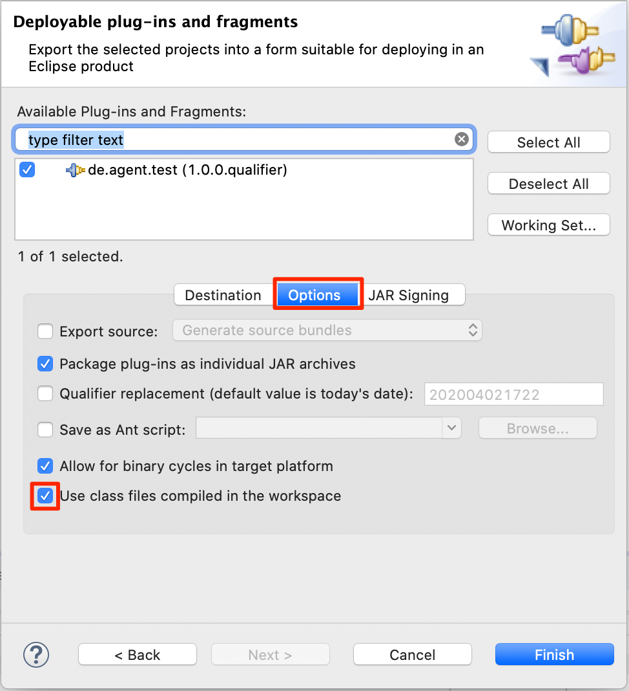
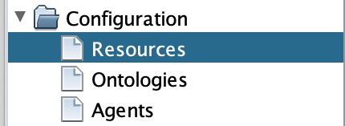
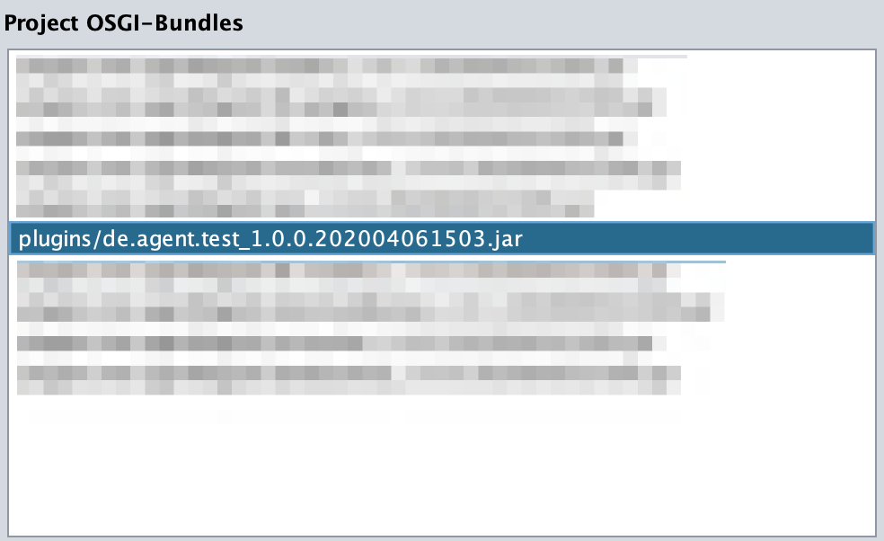

# Export your Plug-in to AWB

## Export the Plug-in

This tutorial shows you how to include and use your plug-ins \(OSGI bundels\) in an Agent.Workbench - project outside of the Eclipse IDE. This will allow you to start an AWB-project from an AWB-installation that uses your agents or your application extensions. This is done by exporting the Eclipse plug-in into a projects subdirectory \(e.g. _./myProject/plugins_\). Opening a project, Agent.Workbench will search in the project directory for OSGI-bundles and will load them automatically.

In your Eclipse IDE, right-click the Eclipse project you want to export and choose _Export_.

Under _Plug-in Development_ choose _Deployable plug-ins and fragments_, then click _Next_.

Now select the plug-in and specify the directory you want to export to. Note, when exporting to a directory, the plug-ins will be placed in a _plugins/_ subdirectory of the chosen directory. As the directory, simply choose your Agent.Workbench project-folder, even it contains a _plugins/_ subdirectory already. 

As a last step, go to the _Options_ tab. Select the checkbox "_use class files compiled in the workspace"._ Then click _Finish_.

## Check if the export was successful

To check if the export was successful, open \(or re-open\) your AWB-project and go to the _Resources_ tab in the project window.

Your plug-in should appear in the list of _Project OSGI-Bundles_. If it does, the export was successful.

