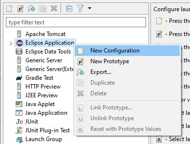
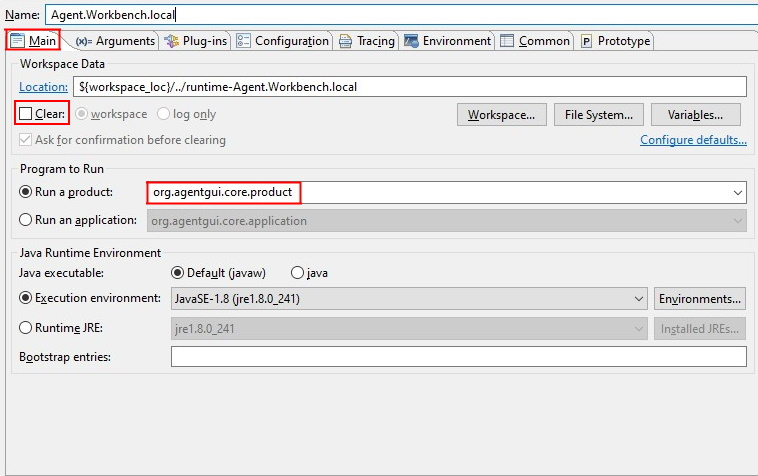
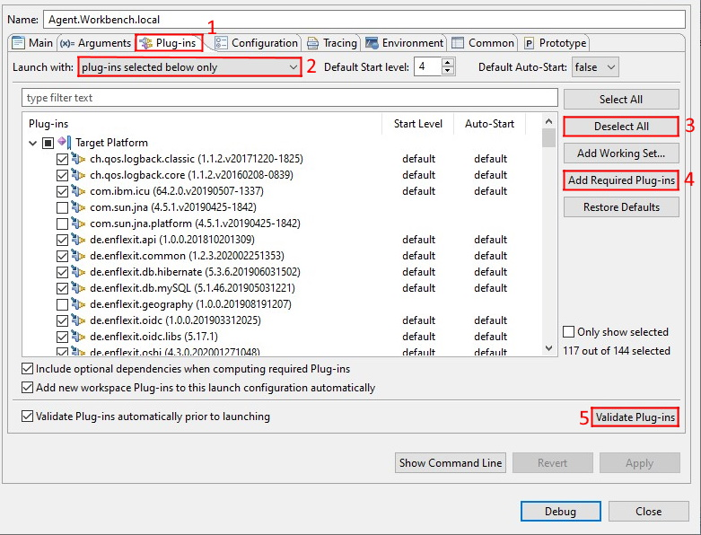

# Starting AWB from Eclipse

### Create a Configuration and select the plug-ins

As  a next step we are going to configure the Run configuration. Click the arrow next to the debug icon and click _Debug Configurations..._ .

In the explorer on the left, right-click _Eclipse Application_ and choose _New Configuration_.

Name the configuration \(e.g "Agent.Workbench.local"\). In the Main tab, check if _Run a product_ equals _org.agentgui.core.product_.

Then open the _Plug-ins tab_ \(1\). Make sure you select _Launch with: plug-ins selected below only_ \(2\).

To create our own custom configuration, we need to deselect all selected plug-ins with the _Deselect All_ button \(3\). To avoid any problems, it is important to execute the following steps in the exact order. To avoid any problems, execute the following steps in the exact order.

First we must select the following plug-ins:

* org.eclipse.core.runtime \(Start Level 1, Auto-Start: true\)
* org.apache.felix.scr \(Start Level: 2, Auto-Start: true\)
* org.eclipse.equinox.event \(Start Level: 2, Auto-Start: true\)
* org.agentgui.core

Then click _Add Required Plug-ins_ \(4\) and _Validate Plug-ins_ \(5\). A window should show up, saying that no problems were detected.

Now you can launch Agent.Workbench with the launch configuration from the IDE.

### Problems after validating plug-ins

In some cases after validating the plug-ins, a dialogue shows up saying that problems were detected.

To solve this problem, we need to add the required bundle:

* org.apache.commons.logging

After you selected the plug-in, click _Add Required Plug-ins_ \(4\), then _Validate Plug-ins_ \(5\). No more problems should be detected.

