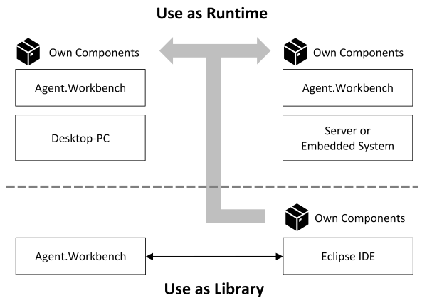

# Overview

## What is **Agent.Workbench?**

Agent.Workbench is an Eclipse RCP based toolkit and framework. It provides both, a predefined runtime environment and a predefined end user application that can be extended and utilized, which enables to develop end user oriented, agent-based applications. It also allows to develop agent systems that are located on servers or distributed embedded systems.

Agent.Workbench can be used in two ways: First, as a development base and thus as a library, which you can develop your own components against. Second, as a runtime environment, in which the individually developed software components are executed and fulfill the applications purpose.

Agent.Workbench follows the modular approach of Eclipse RCP. The “product” Agent.Workbench consists of a core “feature” that again consists of multiple “plugins” or OSGI bundles respectively. It should be briefly mentioned here that we use the notion of the terms “bundle” and “plugin” synonymously.

With Agent.Workbench, our goal is to provide a universal foundation for people from various domains to create agent systems and utilize them for their own purpose.

The different ways to use Agent.Workbench lead to the definition of different groups of users. Depending on the group, Agent.Workbench is either the main subject of work or just a tool.

## Who uses Agent.Workbench?

Generally speaking, we can distinguish two major groups of Agent.Workbench users, the developers and the end-users.

The developer group itself is subdivided into two types of developers, the "Agent.Workbench developers" and the "project developers". As an "Agent.Workbench developer", you extend the functionality of the framework itself by contributing new features to it. As a "project developer", you aim to develop standalone end-user desktop applications, or applications that can operate on servers or embedded systems. "Project" here means the Agent.Workbench framework, plus additional individual components. These individual components are typically domain specific features which define different agents for different use cases.

The other group consists of the end-users. End users are typically non-programmers from different fields of work, who use the Agent.Workbench based projects for their own purpose. Those end-user applications are typically used to create and execute agent-systems.

## What can you develop?

Agent.Workbench provides various development opportunities. You can read more on the Agent.Workbench use cases [here](agent.workbench-use-cases.md).

