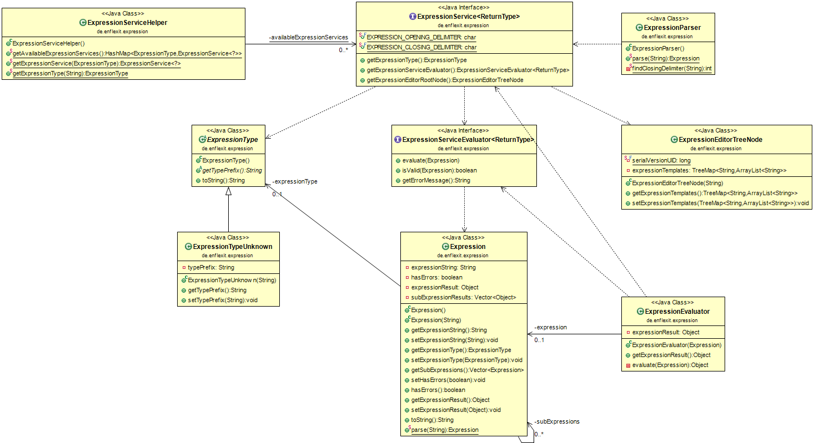

###ExpressionService

Der modulare und erweiterungsfähige ExpressionServie ermöglicht die Erweiterung zur Behandlung und Auswertung von Ausdrücken, die als String spezifiziert werden.

- **ExpressionService<ReturnType> (Ausdrucks-Service)**: Beschreibt die Struktur eines Ausdruck-Services und gibt hierzu drei Typen zurück.  
	Dies sind die servicespezifischen :  
	- **ExpressionType**: Beschreibt auf globaler Ebene eindeutig den Typ eines Ausdrucks.  
	- **ExpressionServiceEvaluator**: Gibt den spezifischen Evaluator zurück, der von einem Service angeboten wird.  
	- **ExpressionEditorTreeNode**: Gibt den Knoten zurück, der im Editor-Fenster eingebunden werden soll.  
	
	
- **ExpressionServiceHelper**: Klasse mit statischen Methoden zum Handling von Ausdruck-Services.
- **ExpressionParser**: Verwandelt eine String in eine Expression.
- **Expression**: Representiert einen umgewandelten String, der bereits geparst wurde und somit nach ExpressionType und Sub-Expressions aufgelöst wurde.
- **ExpressionEvaluator**: Bietet eine statische Klasse zur Auswertung von Expressions. Dabei werden 

####Class-Overview

